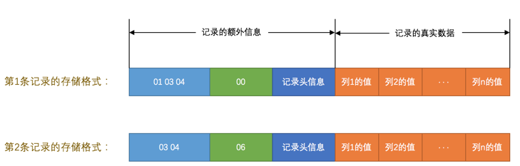
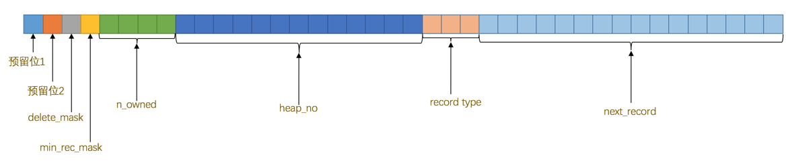
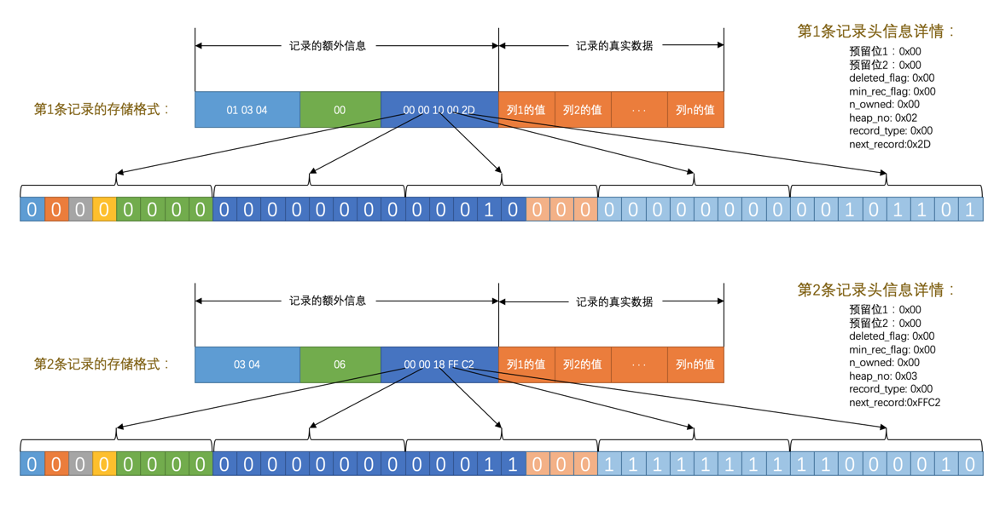
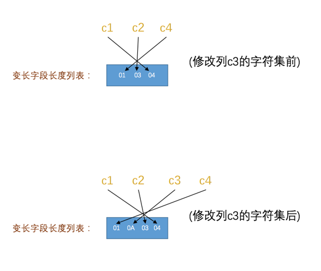
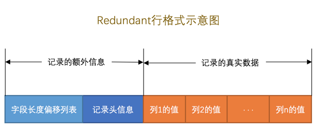
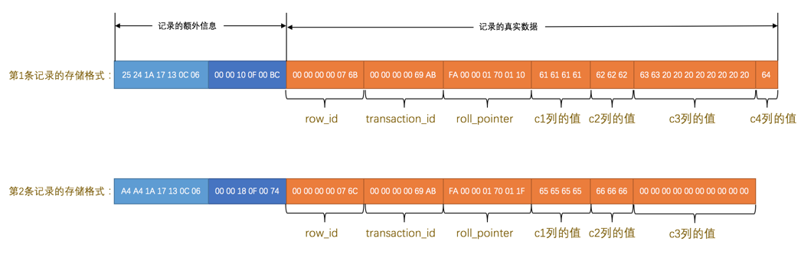

# InnoDB 记录存储结构
MySQL 服务端负责对表中数据的读取和写入工作的部分是**存储引擎**，MySQL 服务端支持不同类型的存储引擎。真实数据在不同存储引擎中存放的格式一般是
不同的，甚至有 Memory 存储引擎都不用磁盘来存储数据。

## InnoDB 页简介
InnoDB 是一个将表中的数据存储到磁盘上的存储引擎。而读写磁盘的速度非常慢，所以 InnoDB 采取的方式是：**将数据划分为若干个页，以页作为磁盘和内存
之间交互的基本单位，

InnoDB 中页的大小一般为 `16 KB`。也就是在一般情况下，一次最少从磁盘中读取 `16KB` 的内容到内存中，一次最少把内存中的 `16KB` 内容刷新到磁盘中。

## InnoDB 行格式
我们平时是以记录为单位来向表中插入数据的，这些记录在磁盘上的存放方式被称为 `行格式` 或者 `记录格式`。InnoDB 存储引擎目前有 4 种不同类型的行格式，
分别是 `Compact`、`Redundant`、`Dynamic` 和` Compressed` 行格式。

### 指定行格式的语法
创建或修改表的语句中指定行格式：
```sql
CREATE TABLE 表名 (列的信息) ROW_FORMAT=行格式名称

ALTER TABLE 表名 ROW_FORMAT=行格式名称
```

比如在 `test` 数据库里创建一个演示用的表 `record_format_demo`，可以这样指定它的**行格式**：
```sh
mysql> USE test;
Database changed

mysql> CREATE TABLE record_format_demo (
    ->     c1 VARCHAR(10),
    ->     c2 VARCHAR(10) NOT NULL,
    ->     c3 CHAR(10),
    ->     c4 VARCHAR(10)
    -> ) CHARSET=ascii ROW_FORMAT=COMPACT;
Query OK, 0 rows affected (0.03 sec)
```
刚刚创建的这个表的行格式就是 `Compact`，另外显式指定了这个表的字符集为 `ascii`，因为 `ascii` 字符集只包括空格、标点符号、数字、大小写字
母和一些不可见字符，所以汉字是不能存到这个表里的。现在向这个表中插入两条记录：
```sh
mysql> INSERT INTO record_format_demo(c1, c2, c3, c4) VALUES('aaaa', 'bbb', 'cc', 'd'), ('eeee', 'fff', NULL, NULL);
Query OK, 2 rows affected (0.02 sec)
Records: 2  Duplicates: 0  Warnings: 0
```

### COMPACT行格式


一条完整的记录其实可以被分为**记录的额外信息**和**记录的真实数据**两大部分。

#### 记录的额外信息
为了描述这条记录而不得不额外添加的一些信息，分为 3 类，分别是**变长字段长度列表**，**NULL值列表**和**记录头信息**。

##### 变长字段长度列表
MySQL 支持一些变长的数据类型，比如 `VARCHAR(M)`、`VARBINARY(M)`、各种 `TEXT` 类型，各种 `BLOB` 类型，这些数据类型的列被称为**变长字段**。
变长字段中存储多少字节的数据是不固定的，所以我们在存储真实数据的时候需要顺便把这些数据占用的字节数也存起来，这样才不至于把 MySQL 服务器搞懵，所以这
些变长字段占用的存储空间分为两部分：
1. 真正的数据内容
2. 占用的字节数

在 `Compact` 行格式中，把所有变长字段的真实数据占用的字节长度都存放在记录的开头部位，从而形成一个**变长字段长度列表**，各变长字段数据占用的字
节数按照列的顺序逆序存放，注意是**逆序存放**。

拿 `record_format_demo` 表中的第一条记录来举个例子。因为 `record_format_demo` 表的 `c1`、`c2`、`c4` 列都是 `VARCHAR(10)` 类型的，也
就是变长的数据类型，所以这三个列的值的长度都需要保存在记录开头处，因为 `record_format_demo` 表中的各个列都使用的是 `ascii` 字符集，所以每个
字符只需要`1`个字节来进行编码，来看一下第一条记录各变长字段内容的长度：

| 列名| 存储内容 | 内容长度（十进制表示） | 内容长度（十六进制表示） |
| --- | --- | ---| --- |
| c1 | 'aaaa' | 4 | 0x04 |
| c2 | 'bbb' | 3 | 0x03 |
| c4 | 'd' | 1 | 0x01 |

这些长度值需要按照列的逆序存放，所以最后 `变长字段长度列表` 的字节串用十六进制表示的效果就是（各个字节之间实际上没有空格，用空格隔开只是方便理解）：
```
01 03 04
```

把这个字节串组成的变长字段长度列表填入上边的示意图中的效果就是：


由于第一行记录中 `c1`、`c2`、`c4` 列中的字符串都比较短，也就是说内容占用的字节数比较小，用 1 个字节就可以表示，但是如果变长
列的内容占用的字节数比较多，可能就需要用 2 个字节来表示。`InnoDB` 有它的一套规则，我们首先声明一下 `W`、`M` 和 `L` 的意思：

1. 假设某个字符集中表示一个字符最多需要使用的字节数为 `W`，也就是使用 `SHOW CHARSET` 语句的结果中的 `Maxlen` 列，比如 `utf8` 字符集
中的 `W` 就是 `3`，`gbk` 字符集中的 `W` 就是 `2`，`ascii` 字符集中的 `W` 就是 `1`。
2. 对于变长类型 `VARCHAR(M)` 来说，这种类型表示能存储最多 `M` 个字符（注意是字符不是字节），所以这个类型能表示的字符串最多
占用的字节数就是 `M×W`。
3. 假设它实际存储的字符串占用的字节数是 `L`。

所以确定使用 1 个字节还是 2 个字节表示真正字符串占用的字节数的规则就是这样：
- 如果 `M×W <= 255`，那么使用 1 个字节来表示真正字符串占用的字节数。
- 如果 `M×W > 255`，则分为两种情况：
  - 如果 `L <= 127`，则用 1 个字节来表示真正字符串占用的字节数。
  - 如果 `L > 127`，则用 2 个字节来表示真正字符串占用的字节数。

总结一下就是说：**如果该可变字段允许存储的最大字节数（`M×W`）超过 255 字节并且真实存储的字节数（`L`）超过 127 字节，则使用 2 个字节，否则
使用 1 个字节**。

注意，**变长字段长度列表中只存储值为 `非 NULL` 的列内容占用的长度**，值为 `NULL` 的列的长度是不储存的。也就是说对于第二条记录来说，因为 `c4` 
列的值为 `NULL`，所以第二条记录的变长字段长度列表只需要存储 `c1` 和 `c2` 列的长度即可。**并不是所有记录都有这个 `变长字段长度列表` 部分，比方
说表中所有的列都不是变长的数据类型的话，这一部分就不需要有**。

##### NULL 值列表
表中的某些列可能存储 `NULL` 值，如果把这些 `NULL` 值都放到记录的真实数据中存储会很占地方，所以 `Compact` 行格式把这些值为 `NULL` 的列统一
管理起来，存储到 `NULL` 值列表中：
1. 首先统计表中允许存储 NULL 的列有哪些。
主键列、被 `NOT NULL` 修饰的列都是不可以存储 `NULL` 值的，所以在统计的时候不会把这些列算进去。比方说表 `record_format_demo` 的 `3` 
个列 `c1`、`c3`、`c4` 都是允许存储 `NULL` 值的，而 `c2` 列是被 `NOT NULL` 修饰，不允许存储 `NULL` 值。

2. **如果表中没有允许存储 `NULL` 的列，则 `NULL` 值列表也不存在了**，否则将每个允许存储 `NULL` 的列对应一个二进制位，二进制位按照列的顺
序逆序排列，二进制位表示的意义如下：

- 二进制位的值为 `1` 时，代表该列的值为 `NULL`。
- 二进制位的值为 `0` 时，代表该列的值不为 `NULL`。

3. MySQL 规定 **`NULL` 值列表必须用整数个字节的位表示**，如果使用的二进制位个数不是整数个字节，则在字节的高位补 `0`。
表 `record_format_demo` 只有 `3` 个值允许为 `NULL` 的列，对应 `3` 个二进制位，不足一个字节，所以在字节的高位补 `0`，效果就是这样：


这两条记录在填充了 NULL 值列表后的示意图就是这样：


##### 记录头信息
记录头信息，它是由固定的 5 个字节组成。5 个字节也就是 40 个二进制位，不同的位代表不同的意思：


这些二进制位代表的详细信息如下表：

| 名称 | 大小（单位：bit） | 描述 |
| --- | --- | --- |
| 预留位1 | 1 | 没有使用 |
| 预留位2 | 1 | 没有使用 |
| `delete_mask` | 1 | 标记该记录是否被删除 |
| `min_rec_mask` | 1 | B+ 树的每层非叶子节点中的最小记录都会添加该标记 |
| `n_owned` | 4 | 表示当前记录拥有的记录数 |
| `heap_no` | 13 | 表示当前记录在记录堆的位置信息 |
| `record_type` | 3 | 表示当前记录的类型，0 表示普通记录，1 表示 B+ 树非叶子节点记录，2 表示最小记录，3 表示最大记录 |
| `next_record` | 16 | 表示下一条记录的相对位置 |


我们现在直接看一下 `record_format_demo` 中的两条记录的头信息分别是什么：



#### 记录的真实数据
对于 `record_format_demo` 表来说，记录的真实数据除了 `c1`、`c2`、`c3`、`c4` 这几个自己定义的列的数据以外，MySQL 会为每个记录默认的添
加一些列（也称为隐藏列），具体的列如下：

| 列名 | 是否必须 | 占用空间 | 描述 |
| --- | ---| --- | --- |
| `row_id` | 否 | 6 字节 | 行 ID，唯一标识一条记录 |
| `transaction_id` | 是 | 6 字节 | 事务 ID |
| `roll_pointer` | 是 | 7 字节 | 回滚指针 |

> 实际上这几个列的真正名称其实是：`DB_ROW_ID`、`DB_TRX_ID`、`DB_ROLL_PTR`。


InnoDB 表对主键的生成策略：优先使用用户自定义主键作为主键，如果用户没有定义主键，则选取一个`Unique` 键作为主键，如果表中连 `Unique` 键都没
有定义的话，则 InnoDB 会为表默认添加一个名为 `row_id` 的隐藏列作为主键。

**InnoDB 存储引擎会为每条记录都添加 `transaction_id` 和 `roll_pointer` 这两个列**。

看一下 `record_format_demo` 加上记录的真实数据的两个记录长什么样：


注意：
- 表 `record_format_demo` 使用的是 `ascii` 字符集，所以 `0x61616161` 就表示字符串 `'aaaa'`，`0x626262` 就表示字符串 `'bbb'`，以
此类推。
- 注意第 1 条记录中 `c3` 列的值，它是 `CHAR(10)` 类型的，它实际存储的字符串是：`'cc'`，而 `ascii` 字符集中的字节表示是 `'0x6363'`，虽然
表示这个字符串只占用了 2 个字节，但整个 `c3` 列仍然占用了 10 个字节的空间，除真实数据以外的 8 个字节的统统都用空格字符填充，空格字符
在 `ascii` 字符集的表示就是 `0x20`。


#### CHAR(M) 列的存储格式
`record_format_demo` 表的 `c3` 列的类型是 `CHAR(10)`，我们说在 `Compact` 行格式下只会把变长类型的列的长度逆序存到变长字段长度列表中，
但是这只是因为 `record_format_demo` 表采用的是 `ascii` 字符集，这个字符集是一个定长字符集，也就是说表示一个字符采用固定的一个字节，如果
采用变长的字符集（也就是表示一个字符需要的字节数不确定，比如 `gbk` 表示一个字符要 `1~2` 个字节、`utf8` 表示一个字符要 `1~3` 个字节等）的话，`c3`列的长度也会被存储到变长字段长
度列表中，比如修改一下 `record_format_demo` 表的字符集：
```sh
mysql> ALTER TABLE record_format_demo MODIFY COLUMN c3 CHAR(10) CHARACTER SET utf8;
Query OK, 2 rows affected (0.02 sec)
Records: 2  Duplicates: 0  Warnings: 0
```

修改该列字符集后记录的变长字段长度列表也发生了变化，如图：


**对于 `CHAR(M)` 类型的列来说，当列采用的是定长字符集时，该列占用的字节数不会被加到变长字段长度列表，而如果采用变长字符集时，该列占用的字节
数也会被加到变长字段长度列表**。

> **变长字符集的 `CHAR(M)` 类型的列要求至少占用 `M` 个字节**，而 `VARCHAR(M)` 却没有这个要求。比方说对于使用 `utf8` 字符集的 `CHAR(10)` 
的列来说，该列存储的数据字节长度的范围是 `10～30` 个字节。即使我们向该列中存储一个空字符串也会占用 `10` 个字节，这是怕将来更新该列的值的字节长
度大于原有值的字节长度而小于 `10` 个字节时，可以在该记录处直接更新，而不是在存储空间中重新分配一个新的记录空间，导致原有的记录空间成为所谓的碎片。

### Redundant 行格式


把表 `record_format_demo` 的行格式修改为 `Redundant`：
```sh
mysql> ALTER TABLE record_format_demo ROW_FORMAT=Redundant;
Query OK, 0 rows affected (0.05 sec)
Records: 0  Duplicates: 0  Warnings: 0
```



`Redundant` 行格式有什么不同的地方：
#### 字段长度偏移列表
`Redundant` 行格式的开头是**字段长度偏移列表**，与**变长字段长度列表**有两处不同：
- 没有了 **变长** 两个字，意味着 `Redundant` 行格式会把该条记录中所有列（包括隐藏列）的长度信息都按照逆序存储
到 `字段长度偏移列表`。
- 多了个 **偏移** 两个字，这意味着计算列值长度的方式不像 `Compact` 行格式那么直观，它是采用两个相邻数值的差值来计
算各个列值的长度。
比如第一条记录的 `字段长度偏移列表` 是 `25 24 1A 17 13 0C 06` 按照列的顺序排列就是 `06 0C 13 17 1A 24 25`。
按照两个相邻数值的差值来计算各个列值的长度的意思就是：

```
第一列(`row_id`)的长度是 `0x06` 个字节，6 个字节。

第二列(`transaction_id`)的长度是 (`0x0C - 0x06`)个字节，6 个字节。

第三列(`roll_pointer`)的长度是 (`0x13 - 0x0C`)个字节，7 个字节。

第四列(`c1`)的长度是 (`0x17 - 0x13`)个字节，4 个字节。

第五列(`c2`)的长度是 (`0x1A - 0x17`)个字节，3 个字节。

第六列(`c3`)的长度是 (`0x24 - 0x1A`)个字节，10 个字节。

第七列(`c4`)的长度是 (`0x25 - 0x24`)个字节，1 个字节。
```

#### 记录头信息
`Redundant` 行格式的记录头信息占用 6 字节，48 个二进制位：

| 名称 | 大小（单位：bit） | 描述 |
| --- | --- | --- |
| 预留位1 | 1 | 没有使用 |
| 预留位2 | 1 | 没有使用 |
| `delete_mask` | 1 | 标记该记录是否被删除 |
| `min_rec_mask` | 1 | B+ 树的每层非叶子节点中的最小记录都会添加该标记 |
| `n_owned` | 4 | 表示当前记录拥有的记录数 |
| `heap_no` | 13 | 表示当前记录在记录堆的位置信息 |
| `n_field` | 10 | 表示记录中列的数量 |
| `1byte_offs_flag` | 1 | 标记字段长度偏移列表中每个列对应的偏移量是使用1字节还是2字节表示的 |
| `next_record` | 16 | 表示下一条记录的相对位置 |

第一条记录中的头信息是：`00 00 10 0F 00 BC`，对应的值如下：
```
预留位1：0x00
预留位2：0x00
delete_mask: 0x00
min_rec_mask: 0x00
n_owned: 0x00
heap_no: 0x02
n_field: 0x07
1byte_offs_flag: 0x01
next_record:0xBC
```

与 `Compact` 行格式的记录头信息对比，多了 `n_field` 和 `1byte_offs_flag` 这两个属性，少了 `record_type` 这个属性。

#### 1byte_offs_flag 值是怎么选择的

**字段长度偏移列表**实质上是存储每个列中的值占用的空间在记录的真实数据处结束的位置，以 `record_format_demo` 第一条记录为例，`0x06` 代表第一
个列在记录的真实数据第 6 个字节处结束，`0x13` 代表第三个列在记录的真实数据第 19 个字节处结束，最后一个列的偏移量值为 `0x25`，就意味着最后一个
列在记录的真实数据第 37 个字节处结束，也就是说整条记录的真实数据实际上占用 37 个字节。

每个列对应的偏移量可以占用 1 个字节或者 2 个字节来存储，那到底什么时候用 1 个字节，还是 2 个字节？

根据该条 `Redundant` 行格式记录的真实数据占用的总大小来判断：
- 当记录的真实数据占用的字节数不大于 127（十六进制 `0x7F`，二进制 `01111111`）时，每个列对应的偏移量占用 1 个字节。
- 当记录的真实数据占用的字节数大于 127，但不大于 32767（十六进制 `0x7FFF`，二进制 `0111111111111111`）时，每个列对应的偏移量占用 2 个字节。
- 当记录的真实数据占用的字节数大于 32767 时，记录已经存放到了溢出页中，在本页中只保留前 768 个字节和 20 个字节的溢出页面地址（这 20 个字节中还
记录了一些别的信息）。因为字段长度偏移列表处只需要记录每个列在本页面中的偏移就好了，所以每个列使用 2 个字节来存储偏移量就够了。

`1byte_offs_flag` 的属性，为 1 时，表明使用 1 个字节存储。为 0 时，表明使用 2 个字节存储。

#### Redundant 行格式中 NULL 值的处理
`Redundant` 行格式并没有 `NULL` 值列表，所以设计 `Redundant` 行格式在字段长度偏移列表中的各个列对应的偏移量处做了一些特殊处理 —— 将列对
应的偏移量值的第一个 bit 作为是否为 `NULL` 的依据，该 bit 也可以被称之为 **NULL 比特位**。`NULL 比特位` 如果为 1，那么该列的值
就是 `NULL`，否则不是 `NULL`。

- 如果存储 `NULL` 值的字段是定长类型的，比方说 `CHAR(M)` 数据类型的，则 NULL 值也将占用记录的真实数据部分，并把该字段对应的数据使用 `0x00` 字
节填充。
- 如果存储 `NULL` 值的字段是变长数据类型的，则不在记录的真实数据处占用任何存储空间。

##### 一个字节能表示的范围是 `0～255`，为什么在记录的真实数据占用的存储空间大于 127 时就采用 2 个字节表示各个列的偏移量？
正是因为第一个 bit 作为是否为 `NULL` 的依据被占用了。

#### CHAR(M) 列的存储格式
`Redundant` 行格式中十分干脆，不管该列使用的字符集是啥，只要是使用 `CHAR(M)` 类型，占用的真实数据空间就是该字符集表示一个字符最多需要的字节数
和 `M` 的乘积。所以 `Redundant` 行格式的 `CHAR(M)` 类型的列是不会产生碎片的。

### 行溢出数据
#### VARCHAR(M) 最多能存储的数据
`VARCHAR(M)`类型的列最多可以占用 65535 个字节。但是当你创建表时使用 `VARCHAR(65535)`：
```sh
mysql> CREATE TABLE varchar_size_demo(
    ->     c VARCHAR(65535)
    -> ) CHARSET=ascii ROW_FORMAT=Compact;
ERROR 1118 (42000): Row size too large. The maximum row size for the used table type, not counting BLOBs, is 65535. This includes storage overhead, check the manual. You have to change some columns to TEXT or BLOBs
mysql>
```
报错了。ySQL对一条记录占用的最大存储空间是有限制的，除了 BLOB 或者 TEXT 类型的列之外，其他所有的列（不包括隐藏列和记录头信息）占用的字节长度加
起来不能超过 65535 个字节。

#### 记录中的数据太多产生的溢出
MySQL 中磁盘和内存交互的基本单位是**页**，记录都会被分配到某个页中存储。而一个页的大小一般是 `16KB`，也就是 16384 字节，而一个 `VARCHAR(M)` 
类型的列就最多可以存储 65532 个字节，这样就可能造成一个页存放不了一条记录的尴尬情况。

在 `Compact` 和 `Reduntant` 行格式中，对于占用存储空间非常大的列，在记录的真实数据处只会存储该列的一部分数据，把剩余的数据分散存储在几个其
他的页中，然后记录的真实数据处用 20 个字节存储指向这些页的地址（这 20 个字节中还包括这些分散在其他页面中的数据的占用的字节数），从而可以找到剩
余数据所在的页。这个过程也叫做**行溢出**。存储超出字节的那些页面也被称为**溢出页**。


#### 行溢出的临界点
在列存储多少字节的数据时就会发生行溢出？

MySQL 中规定**一个页中至少存放两行记录**。

假设一个只有一个列的表，乱七八糟的额外信息加起来需要 136 个字节的空间，每个记录需要的额外信息是 27 字节。那么发生行溢出现象时需要满足这个式子：
```
136 + 2×(27 + n) > 16384
```

得出的解是：`n > 8098`。也就是说如果一个列中存储的数据大于 8098 个字节，就会发生**行溢出**。这个列就叫**溢出列**。
这个公式只是针对只有一个列的表。

**我们只要知道如果在一个行中存储了很大的数据时，可能发生行溢出的现象**。

### Dynamic 和 Compressed 行格式
MySQL 5.7，它的默认行格式就是 `Dynamic`。

这两个格式和 `Compact` 行格式挺像，只不过在处理**行溢出**数据时不同，它们不会在记录的真实数据处存储字段真实数据的前 768 个字节，而是
把**所有的字节都存储到其他页面中，只在记录的真实数据处存储其他页面的地址**

`Compressed` 行格式和 `Dynamic` 不同的一点是，`Compressed` 行格式会采用压缩算法对页面进行压缩，以节省空间。