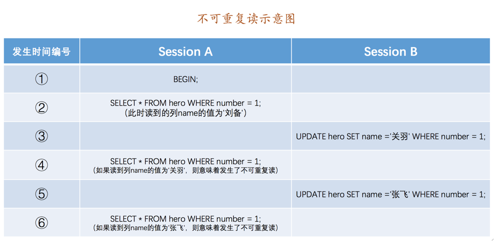

```sql
CREATE TABLE hero (
    number INT,
    name VARCHAR(100),
    country varchar(100),
    PRIMARY KEY (number)
) Engine=InnoDB CHARSET=utf8;
```

## 事务并发执行遇到的问题

当数据库上多个事务并发执行的时候，就可能出现**脏写**（Dirty Write）、**脏读**（Dirty Read）、**不可重复读**（Non-Repeatable Read）、
**幻读**（Phantom Read）的问题。

问题按照严重性来排序：

```
脏写 > 脏读 > 不可重复读 > 幻读
```

### 脏写

"脏写"是指，**一个事务修改了另一个未提交事务修改过的数据**。

### 脏读

"脏读"是指，**一个事务读到了另一个未提交事务修改过的数据**。

### 不可重复读

"不可重复读"是指，**一个事务只能读到另一个已经提交的事务修改过的数据，并且其他事务每对该数据进行一次修改并提交后，该事务都能查询得到最新值**。



如上图在 Session B 中提交了几个隐式事务（注意是隐式事务，意味着语句结束事务就提交了），这些事务都修改了 number 列为 1 的记录的列 name 的值，每次事务提交之后，Session A 中的事务都可以查看到最新的值，这就是不可重复读。

### 幻读

"幻读"是指。**一个事务先根据某些条件查询出了一些记录，然后另一个事务又向表中插入了一些符合这些条件的记录，第一个事务再次使用相同条件查询时，把另一个事务插入的记录也读出来了**。


如上图，Session A 中的事务先根据条件 `number > 0` 这个条件查询表 hero，得到了 name 列值为'刘备'的记录；之后 Session B 中提交了一个隐式事务，该事务向表 hero 中插入了一条新记录；之后 Session A 中的事务再根据相同的条件 `number > 0` 查询表 hero，得到的结果集中包含了 Session B 中的事务新插入的那条记录，这就是幻读。

> 那对于先前已经读到的记录，之后记录被别的事物删除了，导致又读取不到了，这种情况，算不算幻读？这不属于幻读，幻读只是重点强调了读取到了之前读取没有获取到的记录。

## 四种隔离级别

为了解决事务并发执行遇到的问题，就有了**隔离级别**的概念。SQL 标准中设立了 4 个隔离级别：

- `READ UNCOMMITTED`：**读未提交**是指，一个事务还没提交时，它做的变更就能被别的事务看到。可能发生脏读、不可重复读和幻读问题。
- `READ COMMITTED`：**读已提交**是指，一个事务提交之后，它做的变更才会被其他事务看到。可能发生不可重复读和幻读问题，但是不可以发生脏读问题。
- `REPEATABLE READ`：**可重复读**是指，一个事务执行过程中看到的数据，总是跟这个事务在启动时看到的数据是一致的。可能发生幻读问题，但是不可以发生脏读和不可重复读的问题。
- `SERIALIZABLE`：**可串行化**是指，对于同一行记录，“写”会加“写锁”，“读”会加“读锁”。当出现读写锁冲突的时候，后访问的事务必须等前一个事务执行完成，才能继续执行。

MySQL 的默认隔离级别为 `REPEATABLE READ`。**MySQL在 `REPEATABLE READ` 隔离级别下，是可以禁止幻读问题的发生的**。

**隔离级别越低，越严重的问题就越可能发生**。

### 设置事务的隔离级别

```sql
SET [GLOBAL|SESSION] TRANSACTION ISOLATION LEVEL level;
```

level可选值有4个：REPEATABLE READ，READ COMMITTED，READ UNCOMMITTED，SERIALIZABLE

启动参数 `transaction-isolation` 可以设置事务的默认隔离级别。

## MVCC 原理

InnoDB 存储引擎它的聚簇索引记录中都包含两个必要的隐藏列：

- `trx_id`：每次一个事务对某条聚簇索引记录进行改动时，都会把该事务的事务id赋值给trx_id隐藏列。
- `roll_pointer`：每次对某条聚簇索引记录进行改动时，都会把旧的版本写入到undo日志中，然后这个隐藏列就相当于一个指针，可以通过它来找到该记录修改前的信息。
