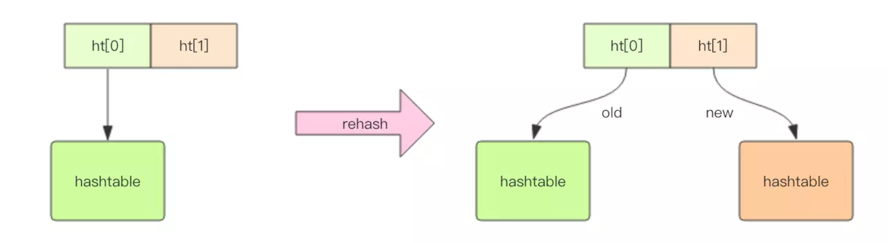

Redis 中除了 hash 结构的数据会用到字典外，整个 Redis 数据库的所有 key 和 value 也组成了一个全局字典，还有带过期时间的 key 集合
也是一个字典。zset 集合中存储 value 和 score 值的映射关系也是通过字典实现的。

set 的结构底层实现也是字典，只不过所有的 value 都是 NULL，其它的特性和字典一模一样。

```c
struct RedisDb {
    dict* dict; // all keys  key=>value
    dict* expires; // all expired keys key=>long(timestamp)
    ...
}

struct zset {
    dict *dict; // all values  value=>score
    zskiplist *zsl;
}
```

## 字典的结构



dict 结构内部包含两个 hashtable，通常情况下只有一个 hashtable 是有值的。但是在 dict 扩容缩容时，需要分配新的 hashtable，然后
进行渐进式搬迁，这时候两个 hashtable 存储的分别是旧的 hashtable 和新的 hashtable。待搬迁结束后，旧的 hashtable 被删除，新
的 hashtable 取而代之。

字典就是基于[散列表](https://shipengqi.github.io/algorithm-learn/hash_table.html)的原理实现的。

## 渐进式 rehash

**rehash 动作并不是一次性、集中式地完成的， 而是分多次、渐进式地完成的**。

原因在于，Redis 是单线程的，如果哈希表里保存的键值对数量非常庞大，一次性 rehash 庞大的计算量会导致服务器一段时间内停止服务。

渐进式 rehash 的详细步骤：

1. 为 `ht[1]` 分配空间，让字典同时持有 `ht[0]` 和 `ht[1]` 两个哈希表。
2. 在字典中维持一个索引计数器变量 `rehashidx` ，并将它的值设置为 0 ， 表示 rehash 工作正式开始。
3. 在 rehash 进行期间，每次对字典执行添加、删除、查找或者更新操作时，程序除了执行指定的操作以外，还会顺带将 `ht[0]` 哈希表在 `rehashidx` 索引上的所有键值对 rehash 到 `ht[1]` ，当 rehash 工作完成之后，程序将 `rehashidx` 属性的值增一。
4. 随着字典操作的不断执行，最终在某个时间点上， `ht[0]` 的所有键值对都会被 rehash 至 `ht[1]` ，这时程序将 `rehashidx` 属性的值
设为 `-1`，表示 rehash 操作已完成。

渐进式 rehash 的过程中，字典会同时使用 `ht[0]` 和 `ht[1]` 两个哈希表，所以在**渐进式 rehash 进行期间， 字典的删除（delete）、查找（find）、更新（update）等操作会在两个哈希表上进行**。

## 扩容条件

```c
/* Expand the hash table if needed */
static int _dictExpandIfNeeded(dict *d)
{
    /* Incremental rehashing already in progress. Return. */
    if (dictIsRehashing(d)) return DICT_OK;

    /* If the hash table is empty expand it to the initial size. */
    if (d->ht[0].size == 0) return dictExpand(d, DICT_HT_INITIAL_SIZE);

    /* If we reached the 1:1 ratio, and we are allowed to resize the hash
     * table (global setting) or we should avoid it but the ratio between
     * elements/buckets is over the "safe" threshold, we resize doubling
     * the number of buckets. */
    if (d->ht[0].used >= d->ht[0].size &&
        (dict_can_resize ||
         d->ht[0].used/d->ht[0].size > dict_force_resize_ratio))
    {
        return dictExpand(d, d->ht[0].used*2);
    }
    return DICT_OK;
}
```

正常情况下，当 hash 表中元素的个数等于数组的长度时，就会开始扩容，扩容的新数组是原数组大小的 2 倍。不过如果 Redis 正在做 bgsave，为
了减少内存页的过多分离 (Copy On Write)，Redis 尽量不去扩容 (dict_can_resize)，但是如果 hash 表已经非常满了，元素的个数已经达
到了数组长度的 5 倍 (dict_force_resize_ratio)，说明 hash 表已经过于拥挤了，这个时候就会强制扩容。

## 缩容条件

```c
int htNeedsResize(dict *dict) {
    long long size, used;

    size = dictSlots(dict);
    used = dictSize(dict);
    return (size > DICT_HT_INITIAL_SIZE &&
            (used*100/size < HASHTABLE_MIN_FILL));
}
```

当 hash 表因为元素的逐渐删除变得越来越稀疏时，Redis 会对 hash 表进行缩容来减少 hash 表的数组空间占用。缩容的条件是元素个数
低于数组长度的 10%。缩容不会考虑 Redis 是否正在做 bgsave。
