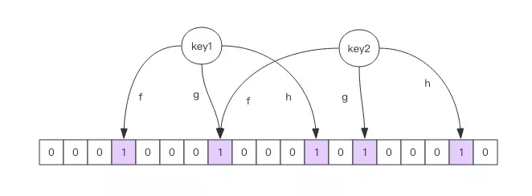

# 布隆过滤器

我们在使用新闻客户端看新闻时，它会给我们不停地推荐新的内容，它每次推荐时要去重，去掉那些已经看过的内容。问题来了，新闻客户端推荐系统
如何实现推送去重的？

`HyperLogLog` 结构就无能为力了，它只提供了 `pfadd` 和 `pfcount` 方法，没有提供 `pfcontains` 这种方法。

你会想到服务器记录了用户看过的所有历史记录，当推荐系统推荐新闻时会从每个用户的历史记录里进行筛选，过滤掉那些已经存在的记录。
问题是当用户量很大，每个用户看过的新闻又很多的情况下，这种方式，推荐系统的去重工作在性能上跟的上么？

**布隆过滤器** (Bloom Filter) 就是专门用来解决这种去重问题的。它在起到去重的同时，在空间上还能节省 90% 以上，只是稍微有那么点不精
确，也就是有一定的误判概率。

## 布隆过滤器是什么？

布隆过滤器可以理解为一个不怎么精确的 `set` 结构，当你使用它的 `contains` 方法判断某个对象是否存在时，它可能会误判。但是布隆过滤器也不
是特别不精确，只要参数设置的合理，它的精确度可以控制的相对足够精确，只会有小小的误判概率。

**当布隆过滤器说某个值存在时，这个值可能不存在；当它说不存在时，那就肯定不存在**。

布隆过滤器能准确过滤掉那些已经看过的内容，那些没有看过的新内容，它也会过滤掉极小一部分 (误判)，但是绝大多数新内容它都能准确识别。

## Redis 中的布隆过滤器
Redis 官方提供的布隆过滤器到了 Redis 4.0 提供了插件功能之后才正式登场。布隆过滤器作为一个插件加载到 Redis Server 中，给 Redis 提供
了强大的布隆去重功能。

```sh
> docker pull redislabs/rebloom  # 拉取镜像
> docker run -p6379:6379 redislabs/rebloom  # 运行容器
> redis-cli  # 连接容器中的 redis 服务
```

## 使用
布隆过滤器有二个基本指令，**`bf.add` 添加元素，`bf.exists` 查询元素是否存在**，它的用法和 `set` 集合的 `sadd` 和 `sismember` 差不多。
注意 `bf.add` 只能一次添加一个元素，如果想要一次**添加多个，就需要用到 `bf.madd` 指令**。同样如果需要一次**查询多个元素是否存在，就
需要用到 `bf.mexists` 指令**。

```sh
127.0.0.1:6379> bf.add codehole user1
(integer) 1
127.0.0.1:6379> bf.add codehole user2
(integer) 1
127.0.0.1:6379> bf.add codehole user3
(integer) 1
127.0.0.1:6379> bf.exists codehole user1
(integer) 1
127.0.0.1:6379> bf.exists codehole user2
(integer) 1
127.0.0.1:6379> bf.exists codehole user3
(integer) 1
127.0.0.1:6379> bf.exists codehole user4
(integer) 0
127.0.0.1:6379> bf.madd codehole user4 user5 user6
1) (integer) 1
2) (integer) 1
3) (integer) 1
127.0.0.1:6379> bf.mexists codehole user4 user5 user6 user7
1) (integer) 1
2) (integer) 1
3) (integer) 1
4) (integer) 0
```

**布隆过滤器只会对已经存在的元素误判，如果布隆过滤器判断不存在那就肯定不存在**。

### 自定义参数的布隆过滤器
Redis 其实还提供了自定义参数的布隆过滤器，需要我们在 `add` 之前使用 `bf.reserve` 指令显式创建。如果对应的 `key` 已经存在，
`bf.reserve` 会报错。

`bf.reserve` 有三个参数：
- `key`
- `error_rate` 错误率越低，需要的空间越大。
- `initial_size` 参数表示预计放入的元素数量，当实际数量超出这个数值时，误判率会上升。

`initial_size` 需要提前设置一个较大的数值避免超出导致误判率升高。如果不使用 `bf.reserve`，默认的 `error_rate` 是 `0.01`，
默认的 `initial_size` 是 `100`。

#### 注意事项
布隆过滤器的 **`initial_size` 估计的过大，会浪费存储空间，估计的过小，就会影响准确率**，用户在使用之前一定要尽可能地精确估计好元素数
量，还需要加上一定的冗余空间以避免实际元素可能会意外高出估计值很多。

布隆过滤器的 **`error_rate` 越小，需要的存储空间就越大，对于不需要过于精确的场合，`error_rate` 设置稍大一点也无伤大雅**。比如在
新闻去重上而言，误判率高一点只会让小部分文章不能让合适的人看到，文章的整体阅读量不会因为这点误判率就带来巨大的改变。

## 布隆过滤器的原理


每个布隆过滤器对应到 Redis 的数据结构里面就是一个大型的位数组和几个不一样的无偏 hash 函数。所谓无偏就是能够把元素的 hash 值算得比较均匀。

向布隆过滤器中添加 key 时，会使用多个 hash 函数对 key 进行 hash 算得一个整数索引值然后对位数组长度进行取模运算得到一个位置，每个 hash 
函数都会算得一个不同的位置。再把位数组的这几个位置都置为 1 就完成了 add 操作。

向布隆过滤器询问 key 是否存在时，跟 add 一样，也会把 hash 的几个位置都算出来，看看位数组中这几个位置是否都为 1，只要有一个位为 0，那
么说明布隆过滤器中这个 key 不存在。如果都是 1，这并不能说明这个 key 就一定存在，只是极有可能存在，因为这些位被置为 1 可能是因为其它
的 key 存在所致。如果这个位数组比较稀疏，判断正确的概率就会很大，如果这个位数组比较拥挤，判断正确的概率就会降低。

## 布隆过滤器的其它应用
在爬虫系统中，我们需要对 URL 进行去重，已经爬过的网页就可以不用爬了。但是 URL 太多了，几千万几个亿，如果用一个集合装下这些 URL 地址
那是非常浪费空间的。这时候就可以考虑使用布隆过滤器。它可以大幅降低去重存储消耗，只不过也会使得爬虫系统错过少量的页面。

布隆过滤器在 NoSQL 数据库领域使用非常广泛，我们平时用到的 HBase、Cassandra 还有 LevelDB、RocksDB 内部都有布隆过滤器结构，布
隆过滤器可以显著降低数据库的 IO 请求数量。当用户来查询某个 row 时，可以先通过内存中的布隆过滤器过滤掉大量不存在的 row 请求，然后再去磁
盘进行查询。

邮箱系统的垃圾邮件过滤功能也普遍用到了布隆过滤器，因为用了这个过滤器，所以平时也会遇到某些正常的邮件被放进了垃圾邮件目录中，这个就是误
判所致，概率很低。
