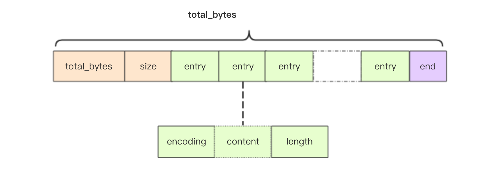

Redis 5.0 引入了数据结构 listpack，它是对 ziplist 结构的改进，在存储空间上会更加节省，而且结构上也比 ziplist 要精简。
listpack 的设计的目的是用来取代 ziplist，但是 ziplist 在 Redis 数据结构中使用太广泛了，替换起来复杂度会非常之高。目前只使用在了新增
加的 Stream 数据结构中。

```c
struct listpack<T> {
    int32 total_bytes; // 占用的总字节数
    int16 size; // 元素个数
    T[] entries; // 紧凑排列的元素列表
    int8 end; // 同 zlend 一样，恒为 0xFF
}
```



listpack 跟 ziplist 的结构几乎一摸一样，只是少了一个 `zltail_offset` 字段。因为 listpack 可以是通过其它方式来定位出最后一个元素
的位置的。

```c
struct lpentry {
    int<var> encoding;
    optional byte[] content;
    int<var> length;
}
```

元素的结构和 ziplist 的元素结构也很类似，都是包含三个字段。不同的是 `length` 字段放在了元素的尾部，而且存储的不是上一个元素的长度，是
**当前元素的长度**。正是因为长度放在了尾部，所以可以省去了 `zltail_offset` 字段来标记最后一个元素的位置，这个位置可以通过 `total_bytes` 字段和最后一个元素的长度字段计算出来。

不同于 skiplist 元素长度的编码为 1 个字节或者 5 个字节，listpack 元素长度的编码可以是 1、2、3、4、5 个字节。同 UTF8 编码一样，它
通过字节的最高为是否为 1 来决定编码的长度。

encoding 字段：

- `0xxxxxxx` 表示非负小整数，可以表示0~127。
- `10xxxxxx` 表示小字符串，长度范围是0~63，content字段为字符串的内容。
- `110xxxxx yyyyyyyy` 表示有符号整数，范围是-2048~2047。
- `1110xxxx yyyyyyyy` 表示中等长度的字符串，长度范围是0~4095，content字段为字符串的内容。
- `11110000 aaaaaaaa bbbbbbbb cccccccc dddddddd` 表示大字符串，四个字节表示长度，content字段为字符串内容。
- `11110001 aaaaaaaa bbbbbbbb` 表示 2 字节有符号整数。
- `11110010 aaaaaaaa bbbbbbbb cccccccc` 表示 3 字节有符号整数。
- `11110011 aaaaaaaa bbbbbbbb cccccccc dddddddd` 表示 4 字节有符号整数。
- `11110011 aaaaaaaa ... hhhhhhhh` 表示 8 字节有符号整数。
- `11111111` 表示 listpack 的结束符号，也就是 `0xFF`。

## 级联更新

listpack 的设计彻底消灭了 ziplist 存在的级联更新行为，元素与元素之间完全独立，不会因为一个元素的长度变长就导致后续的元素内容会受到
影响。
