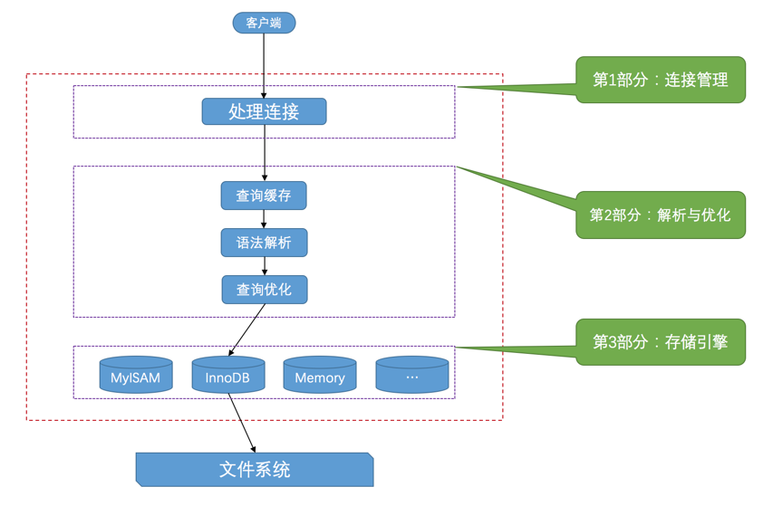

# MySQL 入门
MySQL服务器的进程也被称为**MySQL数据库实例**，简称**数据库实例**。MySQL 服务器进程的默认名称为`mysqld`， 而 MySQL 客户端进程的默认名称为`mysql`。

## 安装

`MySQL`的大部分安装包都包含了服务器程序和客户端程序

> 注意，**在Linux下使用RPM包时会有单独的服务器RPM包和客户端RPM包，需要分别安装**。

### MySQL的安装目录

Linux 下的安装目录一般为`/usr/local/mysql/`。

#### bin目录
打开`/usr/local/mysql/bin`（注意这里要改成你自己的安装目录），执行`tree`：
```
.
├── mysql
├── mysql.server -> ../support-files/mysql.server
├── mysqladmin
├── mysqlbinlog
├── mysqlcheck
├── mysqld           # mysql 的服务端程序
├── mysqld_multi     # 运行多个MySQL服务器进程
├── mysqld_safe
├── mysqldump
├── mysqlimport
├── mysqlpump
... (省略其他文件)
0 directories, 40 files
```

这个目录一般需要配置到环境变量的`PATH`中，Linux中 各个路径以`:`分隔。也可以选择不配：
```bash
/usr/local/bin:/usr/bin:/bin:/usr/sbin:/sbin:/usr/local/mysql/bin
```

##### mysqld_safe
`mysqld_safe`是一个启动脚本，最终也是调用`mysqld`，但是还会另外一个监控进程，在服务器进程挂了的时候，可以帮助重启服务器进程。
`mysqld_safe`启动服务器程序时，会将服务器程序的出错信息和其他诊断信息重定向到某个文件中，产生出错日志，这样可以方便我们找出发生错误的原因。

##### mysql.server
`mysql.server`也是一个启动脚本，会间接的调用`mysqld_safe`，使用`mysql.server`启动服务器程序：
```bash
mysql.server start
```
`mysql.server`文件其实是一个链接文件，它的实际文件是`../support-files/mysql.server`。

##### client
`bin`目录下的`mysql`、`mysqladmin`、`mysqldump`、`mysqlcheck`都是客户端程序，启动客户端程序连接服务器进程：
```bash
mysql --host=<主机名>  --user=<用户名> --password=<密码>
```

注意：
- 最好不要在一行命令中输入密码。
- 如果使用的是类UNIX系统，并且省略`-u`参数后，会把你登陆操作系统的用户名当作MySQL的用户名去处理。

## 客户端与服务器连接的过程
客户端进程向服务器进程发送请求并得到回复的过程本质上是一个**进程间通信的过程**。MySQL支持下边三种进程的通信方式。

### TCP/IP
服务器进程和客户端进程在不同的主机中，它们之间必须通过网络来进行通讯。MMySQL服务器默认监听`3306`端口。
**可以在启动服务器程序的命令行里添加`-P`参数来指定端口号**。客户端连接时，如果不是默认端口，也需要`-P`参数指定端口。

### 命名管道和共享内存
Windows用户，可以使用命名管道或共享内存进行通信。

- 使用命名管道进行进程间通信
需要在启动服务器程序的命令中加上`--enable-named-pipe`参数，然后在启动客户端程序的命令中加入`--pipe`或者`--protocol=pipe`参数。

- 使用共享内存进行进程间通信
使用共享内存的方式进行通信的服务器进程和客户端进程必须在同一台Windows主机中。

需要在启动服务器程序的命令中加上`--shared-memory`参数，在成功启动服务器后，共享内存便成为本地客户端程序的默认连接方式，不过我们也可以在启动客户端
程序的命令中加入`--protocol=memory`参数来显式的指定使用共享内存进行通信。

### Unix域套接字文件
如果服务器进程和客户端进程都在同一台操作系统为类Unix的机器上的话，可以使用Unix域套接字文件来进行进程间通信。

如果**在启动客户端程序的时候指定的主机名为`localhost`，或者指定了`--protocal=socket`的启动参数，那服务器程序和客户端程序之间就可以通过Unix域
套接字文件来进行通信了**。MySQL服务器程序默认监听的Unix域套接字文件路径为`/tmp/mysql.sock`，客户端程序也默认连接到这个Unix域套接字文件。
如果我们想改变这个默认路径，可以在启动服务器程序时指定`socket`参数：
```bash
mysqld --socket=/tmp/a.txt
```

### 服务器处理客户端请求
服务器程序处理来自客户端的查询请求大致需要经过三个部分，分别是**连接管理、解析与优化、存储引擎**。


#### 连接管理
每当有一个客户端进程连接到服务器进程时，服务器进程都会创建一个线程来专门处理与这个客户端的交互，当该客户端退出时会与服务器断开连接，
**服务器并不会立即把与该客户端交互的线程销毁掉，而是把它缓存起来**，在另一个新的客户端再进行连接时，把这个缓存的线程分配给该新客户端。
这样就起到了**不频繁创建和销毁线程**的效果，从而节省开销。

> MySQL服务器会为每一个连接进来的客户端分配一个线程，但是**线程分配的太多了会严重影响系统性能，所以我们也需要限制一下可以同时连接到服务器的客户端数量**。

#### 解析与优化
MySQL服务器获得了文本形式的请求之后，还要经过处理，其中的几个比较重要的部分分别是`查询缓存`、`语法解析`和`查询优化`。

##### 查询缓存
MySQL服务器程序处理查询请求时，会**把刚刚处理过的查询请求和结果缓存起来，如果下一次有一模一样的请求过来，直接从缓存中查找结果**，不用再去底层的表中查找。
而且**查询缓存可以在不同客户端之间共享**。

- 缓存不会命中的情况
  - **如果两个查询请求在任何字符上的不同（例如：空格、注释、大小写），都会导致缓存不会命中**。
  - 如果查询请求中包含某些**系统函数、用户自定义变量和函数、一些系统表**，如`mysql`、`information_schema`、`performance_schema`数据库中的表，那这个请求就不会被缓存。
- 缓存失效
MySQL的缓存系统会监测涉及到的每张表，只要该表的结构或者数据被修改，如对该表使用了`INSERT`、`UPDATE`、`DELETE`、`TRUNCATE TABLE`、`ALTER TABLE`、`DROP TABLE`或`DROP DATABASE`语句，
那使用该表的所有高速缓存查询都将变为无效并从高速缓存中删除！

> **从MySQL 5.7.20开始，不推荐使用查询缓存，并在MySQL 8.0中删除**。查询缓存有时可以提升系统性能，但也不得不因维护这块缓存而造成一些开销，比如每次都要去查询缓存中检索，
询请求处理完需要更新查询缓存，维护该查询缓存对应的内存区域。

##### 语法解析
查询缓存没有命中，接下来就需要进入正式的查询阶段了。因为客户端程序发送过来的请求只是一段文本而已，所以MySQL服务器程序首先要对这段文本做分析，
**判断请求的语法是否正确，然后从文本中将要查询的表、各种查询条件都提取出来放到MySQL服务器内部使用的一些数据结构上来**。

##### 查询优化
语法解析之后，因为我们写的MySQL语句执行起来效率可能并不是很高，MySQL的优化程序会对我们的语句做一些优化，如外连接转换为内连接、表达式简化、子查询转为连接等等。
优化的结果就是生成一个执行计划，这个执行计划表明了应该使用哪些索引进行查询，表之间的连接顺序是啥样的。

#### 存储引擎
ySQL服务器把数据的存储和提取操作都封装到了一个叫存储引擎的模块里。我们知道表是由一行一行的记录组成的，但这只是一个逻辑上的概念，
物理上如何表示记录，怎么从表中读取数据，怎么把数据写入具体的物理存储器上，这都是存储引擎负责的事情。

`连接管理`、`查询缓存`、`语法解析`、`查询优化`这些并不涉及真实数据存储的功能划分为**`MySQL server`的功能**，把真实存取数据的功能划分为**存储引擎的功能**。
各种不同的存储引擎向上边的MySQL server层提供统一的调用接口（也就是存储引擎API），包含了几十个底层函数，像"读取索引第一条内容"、"读取索引下一条内容"、"插入记录"等等。

所以在MySQL server完成了查询优化后，只需按照生成的执行计划调用底层存储引擎提供的API，获取到数据后返回给客户端就好了。

### 常用存储引擎
| 存储引擎 | 描述 |
| -----  | ----- |
| InnoDB |	具备外键支持功能的事务存储引擎 |
| MEMORY |	置于内存的表 |
| MyISAM |	主要的非事务处理存储引擎 |

最常用的就是`InnoDB`和`MyISAM`，有时会提一下`Memory`。`InnoDB`是MySQL默认的存储引擎。

查看当前服务器程序支持的存储引擎：
```sh
SHOW ENGINES;

mysql> SHOW ENGINES;
+--------------------+---------+----------------------------------------------------------------+--------------+------+------------+
| Engine             | Support | Comment                                                        | Transactions | XA   | Savepoints |
+--------------------+---------+----------------------------------------------------------------+--------------+------+------------+
| InnoDB             | DEFAULT | Supports transactions, row-level locking, and foreign keys     | YES          | YES  | YES        |
| MRG_MYISAM         | YES     | Collection of identical MyISAM tables                          | NO           | NO   | NO         |
| MEMORY             | YES     | Hash based, stored in memory, useful for temporary tables      | NO           | NO   | NO         |
| BLACKHOLE          | YES     | /dev/null storage engine (anything you write to it disappears) | NO           | NO   | NO         |
| MyISAM             | YES     | MyISAM storage engine                                          | NO           | NO   | NO         |
| CSV                | YES     | CSV storage engine                                             | NO           | NO   | NO         |
| ARCHIVE            | YES     | Archive storage engine                                         | NO           | NO   | NO         |
| PERFORMANCE_SCHEMA | YES     | Performance Schema                                             | NO           | NO   | NO         |
| FEDERATED          | NO      | Federated MySQL storage engine                                 | NULL         | NULL | NULL       |
+--------------------+---------+----------------------------------------------------------------+--------------+------+------------+
9 rows in set (0.00 sec)

mysql>
```
`Savepoints`代表着该列是否支持部分事务回滚。

#### 设置表的存储引擎
存储引擎是负责对表中的数据进行提取和写入工作的，**可以为不同的表设置不同的存储引擎**，也就是说不同的表可以有不同的物理存储结构，不同的提取和写入方式。

创建表的语句没有指定表的存储引擎，那就会使用默认的存储引擎：
```sql
CREATE TABLE 表名(
    建表语句;
) ENGINE = 存储引擎名称;
```

#### 修改表的存储引擎
```sql
ALTER TABLE 表名 ENGINE = 存储引擎名称;
```