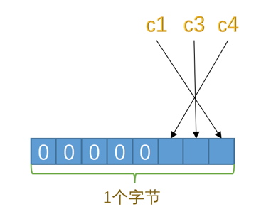
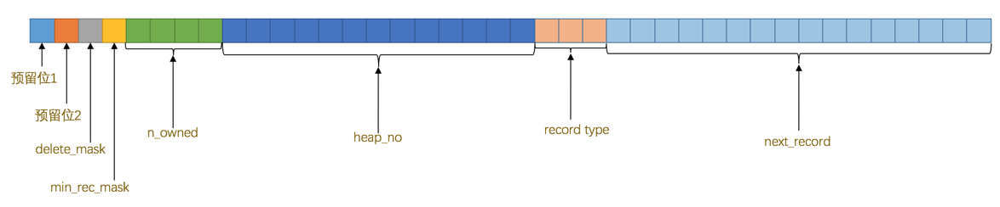
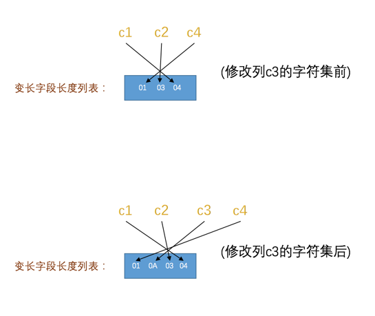
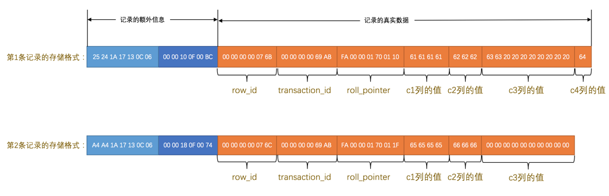

# InnoDB记录存储结构
MySQL服务器上负责对表中数据的读取和写入工作的部分是**存储引擎**，MySQL服务器支持不同类型的存储引擎。真实数据在不同存储引擎中存放的格式一般是不同的，
甚至有`Memory`存储引擎都不用磁盘来存储数据。

## InnoDB页简介
InnoDB是一个将表中的数据存储到磁盘上的存储引擎。而读写磁盘的速度非常慢，所以InnoDB采取的方式是：**将数据划分为若干个页，以页作为磁盘和内存之间交互的基本单位，
InnoDB中页的大小一般为`16 KB`。也就是在一般情况下，一次最少从磁盘中读取`16KB`的内容到内存中，一次最少把内存中的`16KB`内容刷新到磁盘中**。

## InnoDB行格式
我们平时是以记录为单位来向表中插入数据的，这些记录在磁盘上的存放方式被称为`行格式`或者`记录格式`。InnoDB存储引擎目前有4种不同类型的行格式，
分别是`Compact`、`Redundant`、`Dynamic`和`Compressed`行格式。

### 指定行格式的语法
创建或修改表的语句中指定行格式：
```sql
CREATE TABLE 表名 (列的信息) ROW_FORMAT=行格式名称

ALTER TABLE 表名 ROW_FORMAT=行格式名称
```

比如我们在`test`数据库里创建一个演示用的表`record_format_demo`，可以这样指定它的**行格式**：
```sh
mysql> USE test;
Database changed

mysql> CREATE TABLE record_format_demo (
    ->     c1 VARCHAR(10),
    ->     c2 VARCHAR(10) NOT NULL,
    ->     c3 CHAR(10),
    ->     c4 VARCHAR(10)
    -> ) CHARSET=ascii ROW_FORMAT=COMPACT;
Query OK, 0 rows affected (0.03 sec)
```
刚刚创建的这个表的行格式就是`Compact`，另外显式指定了这个表的字符集为`ascii`，因为`ascii`字符集只包括空格、标点符号、数字、大小写字母和一些不可见字符，所以汉字是不能存到这个表里的。
现在向这个表中插入两条记录：
```sh
mysql> INSERT INTO record_format_demo(c1, c2, c3, c4) VALUES('aaaa', 'bbb', 'cc', 'd'), ('eeee', 'fff', NULL, NULL);
Query OK, 2 rows affected (0.02 sec)
Records: 2  Duplicates: 0  Warnings: 0
```

### COMPACT行格式


一条完整的记录其实可以被分为**记录的额外信息**和**记录的真实数据**两大部分。

#### 记录的额外信息
为了描述这条记录而不得不额外添加的一些信息，分为3类，分别是**变长字段长度列表**，**NULL值列表**和**记录头信息**。

##### 变长字段长度列表
MySQL支持一些变长的数据类型，比如`VARCHAR(M)`、`VARBINARY(M)`、各种`TEXT`类型，各种`BLOB`类型，这些数据类型的列被称为**变长字段**。
变长字段中存储多少字节的数据是不固定的，所以我们在存储真实数据的时候需要顺便把这些数据占用的字节数也存起来，这样才不至于把MySQL服务器搞懵，所以这些变长字段占用的存储空间分为两部分：
1. 真正的数据内容
2. 占用的字节数

在`Compact`行格式中，把**所有变长字段的真实数据占用的字节长度都存放在记录的开头部位，从而形成一个变长字段长度列表，各变长字段数据占用的字节数按照列的顺序逆序存放**，
注意是**逆序存放**！

拿`record_format_demo`表中的第一条记录来举个例子。因为`record_format_demo`表的`c1`、`c2`、`c4`列都是`VARCHAR(10)`类型的，也就是变长的数据类型，
所以这三个列的值的长度都需要保存在记录开头处，因为`record_format_demo`表中的各个列都使用的是`ascii`字符集，所以每个字符只需要`1`个字节来进行编码，
来看一下第一条记录各变长字段内容的长度：

| 列名| 存储内容 | 内容长度（十进制表示） | 内容长度（十六进制表示） |
| --- | --- | ---| --- |
| c1 | 'aaaa' | 4 | 0x04 |
| c2 | 'bbb' | 3 | 0x03 |
| c4 | 'd' | 1 | 0x01 |

这些长度值需要按照列的逆序存放，所以最后`变长字段长度列表`的字节串用十六进制表示的效果就是（各个字节之间实际上没有空格，用空格隔开只是方便理解）：
```
01 03 04
```

把这个字节串组成的变长字段长度列表填入上边的示意图中的效果就是：


由于第一行记录中`c1`、`c2`、`c4`列中的字符串都比较短，也就是说内容占用的字节数比较小，用1个字节就可以表示，但是如果变长列的内容占用的字节数比较多，
可能就需要用2个字节来表示。具体用1个还是2个字节来表示真实数据占用的字节数，`InnoDB`有它的一套规则，我们首先声明一下`W`、`M`和`L`的意思：
1. 假设某个字符集中表示一个字符最多需要使用的字节数为`W`，也就是使用`SHOW CHARSET`语句的结果中的`Maxlen`列，比方说`utf8`字符集中的`W`就是`3`，
`gbk`字符集中的`W`就是`2`，`ascii`字符集中的`W`就是`1`。
2. 对于变长类型`VARCHAR(M)`来说，这种类型表示能存储最多`M`个字符（注意是字符不是字节），所以这个类型能表示的字符串最多占用的字节数就是`M×W`。
3. 假设它实际存储的字符串占用的字节数是`L`。

所以确定使用1个字节还是2个字节表示真正字符串占用的字节数的规则就是这样：
- 如果`M×W <= 255`，那么使用1个字节来表示真正字符串占用的字节数。
- 如果`M×W > 255`，则分为两种情况：
  - 如果`L <= 127`，则用1个字节来表示真正字符串占用的字节数。
  - 如果`L > 127`，则用2个字节来表示真正字符串占用的字节数。


总结一下就是说：**如果该可变字段允许存储的最大字节数（`M×W`）超过255字节并且真实存储的字节数（`L`）超过127字节，则使用2个字节，否则使用1个字节**。

> **注意，变长字段长度列表中只存储值为`非NULL`的列内容占用的长度，值为`NULL`的列的长度是不储存的**。也就是说对于第二条记录来说，因为`c4`列的值为`NULL`，
所以第二条记录的变长字段长度列表只需要存储`c1`和`c2`列的长度即可。**并不是所有记录都有这个`变长字段长度列表`部分，比方说表中所有的列都不是变长的数据
类型的话，这一部分就不需要有**。

##### NULL值列表
表中的某些列可能存储`NULL`值，如果把这些`NULL`值都放到记录的真实数据中存储会很占地方，所以`Compact`行格式把这些值为`NULL`的列统一管理起来，存储到`NULL`值列表中，
它的处理过程是这样的：
1. 首先统计表中允许存储NULL的列有哪些。
主键列、被`NOT NULL`修饰的列都是不可以存储`NULL`值的，所以在统计的时候不会把这些列算进去。比方说表`record_format_demo`的`3`个列`c1`、`c3`、`c4`都是
允许存储`NULL`值的，而`c2`列是被`NOT NULL`修饰，不允许存储`NULL`值。

2. **如果表中没有允许存储`NULL`的列，则`NULL`值列表也不存在了**，否则将每个允许存储`NULL`的列对应一个二进制位，二进制位按照列的顺序逆序排列，
二进制位表示的意义如下：
  - 二进制位的值为`1`时，代表该列的值为`NULL`。
  - 二进制位的值为`0`时，代表该列的值不为`NULL`。

3. MySQL规定**`NULL`值列表必须用整数个字节的位表示**，如果使用的二进制位个数不是整数个字节，则在字节的高位补`0`。
表`record_format_demo`只有`3`个值允许为`NULL`的列，对应`3`个二进制位，不足一个字节，所以在字节的高位补`0`，效果就是这样：


##### 记录头信息
记录头信息，它是由固定的5个字节组成。5个字节也就是40个二进制位，不同的位代表不同的意思，如图：


这些二进制位代表的详细信息如下表：
| 名称 | 大小（单位：bit） | 描述 |
| --- | --- | --- |
| 预留位1 | 1 | 没有使用 |
| 预留位2 | 1 | 没有使用 |
| `delete_mask` | 1 | 标记该记录是否被删除 |
| `min_rec_mask` | 1 | B+树的每层非叶子节点中的最小记录都会添加该标记 |
| `n_owned` | 4 | 表示当前记录拥有的记录数 |
| `heap_no` | 13 | 表示当前记录在记录堆的位置信息 |
| `record_type` | 3 | 表示当前记录的类型，0表示普通记录，1表示B+树非叶子节点记录，2表示最小记录，3表示最大记录 |
| `next_record` | 16 | 表示下一条记录的相对位置 |


我们现在直接看一下`record_format_demo`中的两条记录的头信息分别是什么：


#### 记录的真实数据
对于`record_format_demo`表来说，记录的真实数据除了`c1`、`c2`、`c3`、`c4`这几个我们自己定义的列的数据以外，MySQL会为每个记录默认的添加一些列（也称为隐藏列），具体的列如下：
| 列名 | 是否必须 | 占用空间 | 描述 |
| --- | ---| --- | --- |
| `row_id` | 否 | 6字节 | 行ID，唯一标识一条记录 |
| `transaction_id` | 是 | 6字节 | 事务ID |
| `roll_pointer` | 是 | 7字节 | 回滚指针 |

> 实际上这几个列的真正名称其实是：`DB_ROW_ID`、`DB_TRX_ID`、`DB_ROLL_PTR`。


`InnoDB`表对主键的生成策略：优先使用用户自定义主键作为主键，如果用户没有定义主键，则选取一个`Unique`键作为主键，如果表中连`Unique`键都没有定义的话，
则`InnoDB`会为表默认添加一个名为`row_id`的隐藏列作为主键。

**`InnoDB`存储引擎会为每条记录都添加`transaction_id`和`roll_pointer`这两个列，但是`row_id`是可选的（在没有自定义主键以及`Unique`键的情况下才会添加该列）**。

看一下`record_format_demo`加上记录的真实数据的两个记录长什么样：


注意：
- 表`record_format_demo`使用的是`ascii`字符集，所以`0x61616161`就表示字符串`'aaaa'`，`0x626262`就表示字符串`'bbb'`，以此类推。
- 注意第1条记录中`c3`列的值，它是`CHAR(10)`类型的，它实际存储的字符串是：`'cc'`，而`ascii`字符集中的字节表示是`'0x6363'`，虽然表示这个字符串只占用了2个字节，
但整个`c3`列仍然占用了10个字节的空间，除真实数据以外的8个字节的统统都用空格字符填充，空格字符在`ascii`字符集的表示就是`0x20`。


#### CHAR(M)列的存储格式
`record_format_demo`表的`c3`列的类型是`CHAR(10)`，我们说在`Compact`行格式下只会把变长类型的列的长度逆序存到变长字段长度列表中，但是这
只是因为`record_format_demo`表采用的是`ascii`字符集，这个字符集是一个定长字符集，也就是说表示一个字符采用固定的一个字节，如果采用变长的字
符集（也就是表示一个字符需要的字节数不确定，比如`gbk`表示一个字符要`1~2`个字节、`utf8`表示一个字符要`1~3`个字节等）的话，`c3`列的长度也会被存储到变长字段长
度列表中，比如我们修改一下`record_format_demo`表的字符集：
```sh
mysql> ALTER TABLE record_format_demo MODIFY COLUMN c3 CHAR(10) CHARACTER SET utf8;
Query OK, 2 rows affected (0.02 sec)
Records: 2  Duplicates: 0  Warnings: 0
```

修改该列字符集后记录的变长字段长度列表也发生了变化，如图：


**对于`CHAR(M)`类型的列来说，当列采用的是定长字符集时，该列占用的字节数不会被加到变长字段长度列表，而如果采用变长字符集时，该列占用的字节数也会被加到变长字段长度列表**。

> **变长字符集的`CHAR(M)`类型的列要求至少占用`M`个字节**，而`VARCHAR(M)`却没有这个要求。比方说对于使用`utf8`字符集的`CHAR(10)`的列来说，
该列存储的数据字节长度的范围是`10～30`个字节。即使我们向该列中存储一个空字符串也会占用`10`个字节，这是怕将来更新该列的值的字节长度大于原有值的字节长
度而小于`10`个字节时，可以在该记录处直接更新，而不是在存储空间中重新分配一个新的记录空间，导致原有的记录空间成为所谓的碎片。

### Redundant行格式


把表`record_format_demo`的行格式修改为`Redundant`：
```sh
mysql> ALTER TABLE record_format_demo ROW_FORMAT=Redundant;
Query OK, 0 rows affected (0.05 sec)
Records: 0  Duplicates: 0  Warnings: 0
```



`Redundant`行格式有什么不同的地方：
- 字段长度偏移列表
`Redundant`行格式的开头是字段长度偏移列表，与变长字段长度列表有两处不同：
  - 没有了`变长`两个字，意味着`Redundant`行格式会把该条记录中所有列（包括隐藏列）的长度信息都按照逆序存储到`字段长度偏移列表`。
  - 多了个`偏移`两个字，这意味着计算列值长度的方式不像`Compact`行格式那么直观，它是采用两个相邻数值的差值来计算各个列值的长度。
    比如第一条记录的`字段长度偏移列表`是`25 24 1A 17 13 0C 06`按照列的顺序排列就是`06 0C 13 17 1A 24 25`。
    按照两个相邻数值的差值来计算各个列值的长度的意思就是：
    ```
    第一列(`row_id`)的长度就是 0x06个字节，也就是6个字节。

    第二列(`transaction_id`)的长度就是 (0x0C - 0x06)个字节，也就是6个字节。

    第三列(`roll_pointer`)的长度就是 (0x13 - 0x0C)个字节，也就是7个字节。

    第四列(`c1`)的长度就是 (0x17 - 0x13)个字节，也就是4个字节。

    第五列(`c2`)的长度就是 (0x1A - 0x17)个字节，也就是3个字节。

    第六列(`c3`)的长度就是 (0x24 - 0x1A)个字节，也就是10个字节。

    第七列(`c4`)的长度就是 (0x25 - 0x24)个字节，也就是1个字节。
    ```

- 记录头信息
`Redundant`行格式的记录头信息占用6字节，48个二进制位，这些二进制位代表的意思如下：
| 名称 | 大小（单位：bit） | 描述 |
| --- | --- | --- |
| 预留位1 | 1 | 没有使用 |
| 预留位2 | 1 | 没有使用 |
| `delete_mask` | 1 | 标记该记录是否被删除 |
| `min_rec_mask` | 1 | B+树的每层非叶子节点中的最小记录都会添加该标记 |
| `n_owned` | 4 | 表示当前记录拥有的记录数 |
| `heap_no` | 13 | 表示当前记录在记录堆的位置信息 |
| `n_field` | 10 | 表示记录中列的数量 |
| `1byte_offs_flag` | 1 | 标记字段长度偏移列表中每个列对应的偏移量是使用1字节还是2字节表示的 |
| `next_record` | 16 | 表示下一条记录的相对位置 |

第一条记录中的头信息是：`00 00 10 0F 00 BC`，对应的值如下：
```
预留位1：0x00
预留位2：0x00
delete_mask: 0x00
min_rec_mask: 0x00
n_owned: 0x00
heap_no: 0x02
n_field: 0x07
1byte_offs_flag: 0x01
next_record:0xBC
```


