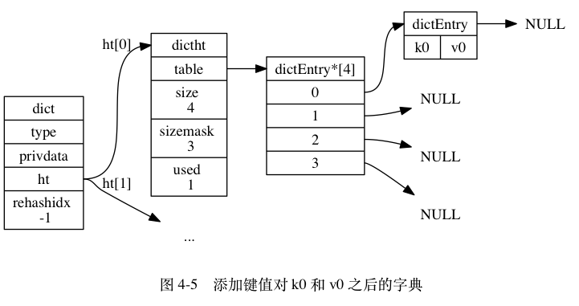
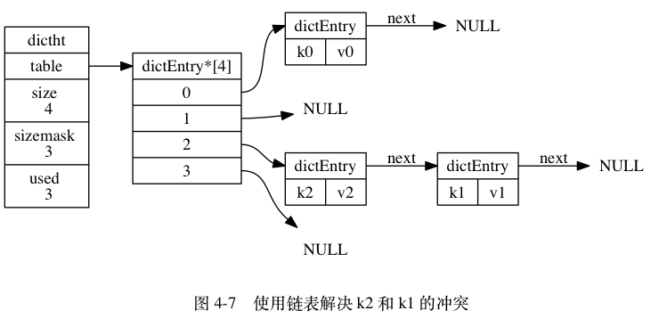
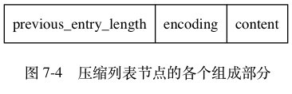

# 数据结构与对象
## 简单动态字符串
Redis 没有直接使用 C 语言传统的字符串表示（以空字符结尾的字符数组，以下简称 C 字符串），而是自己构建了一种名为**简单
动态字符串**（simple dynamic string，SDS）的抽象类型， 并将 **SDS** 用作 Redis 的默认字符串表示。

Redis 中， C 字符串只会作为字符串字面量（string literal），用在一些无须对字符串值进行修改的地方，比如打印日志：
```c
redisLog(REDIS_WARNING,"Redis is now ready to exit, bye bye...");
```

一个可以被修改的字符串值时，Redis 就会使用 SDS 来表示字符串值：比如在 Redis 的数据库里面，包含字符串值的键值对在底层都是由 SDS 实现的。
```sh
redis> SET msg "hello world"
OK
```
其中：
- 键值对的**键是一个字符串对象**，对象的底层实现是一个保存着字符串 "msg" 的 SDS 。
- 键值对的**值也是一个字符串对象**，对象的底层实现是一个保存着字符串 "hello world" 的 SDS 。

又比如：
```sh
redis> RPUSH fruits "apple" "banana" "cherry"
(integer) 3
```
其中：
- 键值对的键是一个字符串对象，对象的底层实现是一个保存了字符串 "fruits" 的 SDS 。
- 键值对的值是一个列表对象，列表对象包含了三个字符串对象，这三个字符串对象分别由三个 SDS 实现：
第一个 SDS 保存着字符串 "apple" ， 第二个 SDS 保存着字符串 "banana" ， 第三个 SDS 保存着字符串 "cherry" 。

**AOF 模块中的 AOF 缓冲区， 以及客户端状态中的输入缓冲区， 都是由 SDS 实现的**。

### SDS 与 C 字符串的区别
#### 常数复杂度获取字符串长度
C 字符串并不记录自身的长度信息，所以为了获取一个 C 字符串的长度，程序必须遍历整个字符串，对遇到的每个字符进行计数，直到遇到代表字符串结尾的空字符为止，
这个操作的复杂度为 `O(N)`。

SDS 在 `len` 属性中记录了 SDS 本身的长度，所以获取一个 SDS 长度的复杂度仅为 `O(1)`。

比如下面的例子，程序只要访问 SDS 的 len 属性， 就可以立即知道 SDS 的长度为 5 字节：


使用 SDS 确保了获取字符串长度的工作不会成为 Redis 的性能瓶颈。

比如说，对一个非常长的字符串键反复执行 `STRLEN` 命令，也不会对系统性能造成任何影响，因为 `STRLEN` 命令的复杂度仅为 `O(1)`。

#### 杜绝缓冲区溢出
C 字符串不记录自身长度带来的另一个问题是容易造成缓冲区溢出（buffer overflow）。

例如，`<string.h>/strcat` 函数可以将 `src` 字符串中的内容拼接到 `dest` 字符串的末尾：
```c
char *strcat(char *dest, const char *src);
```
因为 C 字符串不记录自身的长度，所以 `strcat` 假定用户在执行这个函数时，已经为 `dest` 分配了足够多的内存， 可以容纳 `src` 字符串中的所有内容，而一旦这个假定不成立时，就会产生缓冲区溢出。

SDS 的空间分配策略完全杜绝了发生缓冲区溢出的可能性：当 SDS API 需要对 SDS 进行修改时， API 会先检查 SDS 的空间是否满足修改所需的要求，如果不满足的话，
API 会自动将 SDS 的空间扩展至执行修改所需的大小，然后才执行实际的修改操作，所以使用 SDS 既不需要手动修改 SDS 的空间大小，也不会出现前面所说的缓冲区溢出问题。

比如 SDS 的 API 中的 `sdscat` 函数，它可以将一个 C 字符串拼接到给定 SDS 所保存的字符串的后面，但是在执行拼接操作之前，`sdscat` 会先检查给定 SDS 的空间是否足够，
如果不够的话，`sdscat` 就会先扩展 SDS 的空间， 然后才执行拼接操作。

#### 减少修改字符串时带来的内存重分配次数
C 字符串并不记录自身的长度， 所以对于一个包含了 N 个字符的 C 字符串来说，这个 C 字符串的底层实现总是一个 `N+1` 个字符长的数组（额外的一个字符空间用于保存空字符）。

因为 C 字符串的长度和底层数组的长度之间存在着这种关联性，所以每次增长或者缩短一个 C 字符串，程序都总要对保存这个 C 字符串的数组进行一次内存重分配操作：
- 如果程序执行的是增长字符串的操作，比如拼接操作（append），那么在执行这个操作之前，程序需要先通过内存重分配来扩展底层数组的空间大小 —— 如果忘了这一步就会产生缓冲区溢出。
- 如果程序执行的是缩短字符串的操作，比如截断操作（trim），那么在执行这个操作之后，程序需要通过内存重分配来释放字符串不再使用的那部分空间 —— 如果忘了这一步就会产生内存泄漏。

**在 SDS 中，`buf` 数组的长度不一定就是字符数量加一，数组里面可以包含未使用的字节，而这些字节的数量就由 SDS 的 `free` 属性记录**。

SDS 实现了空间预分配和惰性空间释放两种优化策略。

##### 空间预分配
空间预分配用于优化 SDS 的字符串增长操作：当 SDS 的 API 对一个 SDS 进行修改，并且需要对 SDS 进行空间扩展的时候，程序不仅会为 SDS 分配修改所必须要的空间，
还会为 SDS 分配额外的未使用空间。

额外分配的未使用空间数量由以下公式决定：
- 如果对 SDS 进行修改之后， SDS 的长度（也即是 `len` 属性的值）将小于 `1 MB` ，那么程序分配和 `len` 属性同样大小的未使用空间，
这时 SDS `len` 属性的值将和 `free` 属性的值相同。举个例子，如果进行修改之后， SDS 的 `len` 将变成 13 字节，那么程序也会分配 13 字节的未使用空间， SDS 的 `buf` 数组
的实际长度将变成 `13 + 13 + 1 = 27` 字节（额外的一字节用于保存空字符）。
- 如果对 SDS 进行修改之后， SDS 的长度将大于等于 `1 MB` ，那么程序会分配 `1 MB` 的未使用空间。举个例子，如果进行修改之后， SDS 的 `len` 将变成 `30 MB` ，
那么程序会分配 `1 MB` 的未使用空间， SDS 的 `buf` 数组的实际长度将为 30 MB + 1 MB + 1 byte 。

在扩展 SDS 空间之前，SDS API 会先检查未使用空间是否足够，如果足够的话，API 就会直接使用未使用空间，而无须执行内存重分配。

通过这种预分配策略，SDS 将连续增长 N 次字符串所需的内存重分配次数从必定 N 次降低为最多 N 次。

##### 惰性空间释放
惰性空间释放用于优化 SDS 的字符串缩短操作：当 SDS 的 API 需要缩短 SDS 保存的字符串时，程序并不立即使用内存重分配来回收缩短后多出来的字节，
而是使用 `free` 属性将这些字节的数量记录起来，并等待将来使用。

通过惰性空间释放策略， SDS 避免了缩短字符串时所需的内存重分配操作，并为将来可能有的增长操作提供了优化。

SDS 也提供了相应的 API ，让我们可以在有需要时，真正地释放 SDS 里面的未使用空间，所以不用担心惰性空间释放策略会造成内存浪费。

#### 二进制安全
C 字符串中的字符必须符合某种编码（比如 ASCII），并且除了字符串的末尾之外，字符串里面不能包含空字符，否则最先被程序读入的
空字符将被误认为是字符串结尾 —— 这些限制使得 C 字符串只能保存文本数据， 而不能保存像图片、音频、视频、压缩文件这样的二进制数据。

为了确保 Redis 可以适用于各种不同的使用场景， SDS 的 API 都是**二进制安全**的（binary-safe）：所有 SDS API 都会以处理二进制的方式来处理 SDS 存放在 `buf` 数组里的数据，
程序不会对其中的数据做任何限制、过滤、或者假设 —— **数据在写入时是什么样的，它被读取时就是什么样**。

这也是我们将 SDS 的 `buf` 属性称为字节数组的原因 —— **Redis 不是用这个数组来保存字符，而是用它来保存一系列二进制数据**。

#### 兼容部分 C 字符串函数
SDS 的 API 都是二进制安全的，但它们一样遵循 C 字符串以空字符结尾的惯例：这些 API 总会将 SDS 保存的数据的末尾设置为空字符，并且总会在为 `buf` 数组分配空间时多分配一
个字节来容纳这个空字符，这是为了让那些保存文本数据的 SDS 可以重用一部分 `<string.h>` 库定义的函数。

## 链表
链表提供了高效的节点重排能力，以及顺序性的节点访问方式，并且可以通过增删节点来灵活地调整链表的长度。

作为一种常用数据结构，链表内置在很多高级的编程语言里面，因为 Redis 使用的 C 语言并没有内置这种数据结构，所以 Redis 构建了自己的链表实现。

### 链表节点的实现
每个链表节点使用一个 `adlist.h/listNode` 结构：
```c
typedef struct listNode {

    // 前置节点
    struct listNode *prev;

    // 后置节点
    struct listNode *next;

    // 节点的值
    void *value;

} listNode;
```
使用 `adlist.h/list` 来持有链表：
```c
typedef struct list {

    // 表头节点
    listNode *head;

    // 表尾节点
    listNode *tail;

    // 链表所包含的节点数量
    unsigned long len;

    // 节点值复制函数
    void *(*dup)(void *ptr);

    // 节点值释放函数
    void (*free)(void *ptr);

    // 节点值对比函数
    int (*match)(void *ptr, void *key);

} list;
```
`list` 结构为链表提供了表头指针 `head` 、表尾指针 `tail` ，以及链表长度计数器 `len` ，而 `dup` 、 `free` 和 `match` 成员则是用于实现多态链表所需的类型特定函数：
- `dup` 函数用于复制链表节点所保存的值；
- `free` 函数用于释放链表节点所保存的值；
- `match` 函数则用于对比链表节点所保存的值和另一个输入值是否相等。


Redis 的链表实现的特性：
- 双端：链表节点带有 `prev` 和 `next` 指针，获取某个节点的前置节点和后置节点的复杂度都是 `O(1)`。
- 无环：表头节点的 `prev` 指针和表尾节点的 `next` 指针都指向 `NULL` ，对链表的访问以 `NULL` 为终点。
- 带表头指针和表尾指针：通过 `list` 结构的 `head` 指针和 `tail` 指针，程序获取链表的表头节点和表尾节点的复杂度为 `O(1)`。
- 带链表长度计数器：程序使用 `list` 结构的 `len` 属性来对 `list` 持有的链表节点进行计数，程序获取链表中节点数量的复杂度为 `O(1)`。
- 多态：链表节点使用 `void*` 指针来保存节点值， 并且可以通过 `list` 结构的 `dup` 、 `free` 、 `match` 三个属性为节点值设置类型特定函数，
所以链表可以用于保存各种不同类型的值。

## 字典
字典（dict），又称符号表（symbol table）、关联数组（associative array）或者映射（map），是一种用于保存键值对（key-value pair）的抽象数据结构。

字典中的每个键都是独一无二的，程序可以在字典中根据键查找与之关联的值，或者通过键来更新值，又或者根据键来删除整个键值对，等等。

Redis 构建了自己的字典实现。

**dict 是 Redis 服务器中出现最为频繁的复合型数据结构，除了 `hash` 结构的数据会用到字典外，整个 Redis 数据库的所有 key 和 value 也组成了一个全局字典，
还有带过期时间的 key 集合也是一个字典。`zset` 集合中存储 value 和 score 值的映射关系也是通过 dict 结构实现的。

### 哈希算法
当要将一个新的键值对添加到字典里面时，**程序需要先根据键值对的键计算出哈希值和索引值**（注意这里是根据键计算索引，我所了解的不管是 MySQL 还是 MongoDB 都是根据字段的值计算
索引的，Redis 是 key-value 存储，只需要针对 key 进行增删改查），然后再根据索引值，将包含新键值对的哈希表节点放到哈希表数组的指定索引上面。

Redis 计算哈希值和索引值的方法如下：
```c
# 使用字典设置的哈希函数，计算键 key 的哈希值
hash = dict->type->hashFunction(key);

# 使用哈希表的 sizemask 属性和哈希值，计算出索引值
# 根据情况不同， ht[x] 可以是 ht[0] 或者 ht[1]
index = hash & dict->ht[x].sizemask;
```

比如：将一个键值对 k0 和 v0 添加到字典里面， 那么程序会：
```c
# 计算键 k0 的哈希值
hash = dict->type->hashFunction(k0);

# 假设计算得出的哈希值为 8 ， 那么程序会继续使用语句
index = hash & dict->ht[0].sizemask = 8 & 3 = 0;
```
计算出键 k0 的索引值 0 ，这表示包含键值对 k0 和 v0 的节点应该被放置到哈希表数组的索引 0 位置上。




### 解决键冲突
当有两个或以上数量的键被分配到了哈希表数组的同一个索引上面时，我们称这些键发生了**冲突**（collision）。

Redis 的哈希表使用**链地址法**（separate chaining）来解决键冲突：**每个哈希表节点都有一个 `next` 指针，
多个哈希表节点可以用 `next` 指针构成一个单向链表，被分配到同一个索引上的多个节点可以用这个单向链表连接起来，这就解决了键冲突的问题**。



因为 **`dictEntry` 节点组成的链表没有指向链表表尾的指针，所以为了速度考虑，程序总是将新节点添加到链表的表头位置**（复杂度为 `O(1)`），排在其他已有节点的前面。

### rehash
哈希表保存的键值对会逐渐地增多或者减少，为了让哈希表的负载因子（load factor）维持在一个合理的范围之内，当哈希表保存的键值对数量太多或者太少时，
程序需要对哈希表的大小进行相应的扩展或者收缩。

扩展和收缩哈希表的工作可以通过执行 rehash （重新散列）操作来完成，步骤如下：
1. 为字典的 `ht[1]` 哈希表分配空间，这个哈希表的空间大小取决于要执行的操作，以及 `ht[0]` 当前包含的键值对数量（也即是 `ht[0].used` 属性的值）：
  - 如果执行的是扩展操作， 那么 `ht[1]` 的大小为第一个大于等于 `ht[0].used * 2` 的 `2^n`（2 的 n 次方幂）；
  - 如果执行的是收缩操作， 那么 `ht[1]` 的大小为第一个大于等于 `ht[0].used` 的 `2^n` 。
2. 将保存在 `ht[0]` 中的所有键值对 rehash 到 `ht[1]` 上面： rehash 指的是重新计算键的哈希值和索引值，然后将键值对放置到 `ht[1]` 哈希表的指定位置上。
3. 当 `ht[0]` 包含的所有键值对都迁移到了 `ht[1]` 之后 （`ht[0]` 变为空表）， 释放 `ht[0]` ，将 `ht[1]` 设置为 `ht[0]`， 并在 `ht[1]` 新创建一个空白哈希表，
为下一次 rehash 做准备。

#### 哈希表的扩展与收缩
当以下条件中的任意一个被满足时， 程序会自动开始对哈希表执行扩展操作：
- 服务器目前没有在执行 `BGSAVE` 命令或者 `BGREWRITEAOF` 命令， 并且哈希表的负载因子大于等于 1 ；
- 服务器目前正在执行 `BGSAVE` 命令或者 `BGREWRITEAOF` 命令， 并且哈希表的负载因子大于等于 5 ；
- 当哈希表的负载因子小于 0.1 时， 程序自动开始对哈希表执行收缩操作。

负载因子公式：
```c
# 负载因子 = 哈希表已保存节点数量 / 哈希表大小
load_factor = ht[0].used / ht[0].size

# 例，对于一个大小为 4 ， 包含 4 个键值对的哈希表，负载因子
load_factor = 4 / 4 = 1
```

根据 `BGSAVE` 命令或 `BGREWRITEAOF` 命令是否正在执行， 服务器执行扩展操作所需的负载因子并不相同， 这是因为在执行 `BGSAVE` 命令或 `BGREWRITEAOF` 命令的过程中，
 Redis 需要创建当前服务器进程的子进程， 而大多数操作系统都采用写时复制（copy-on-write）技术来优化子进程的使用效率， 所以在子进程存在期间，
服务器会提高执行扩展操作所需的负载因子， 从而尽可能地避免在子进程存在期间进行哈希表扩展操作， 这可以避免不必要的内存写入操作， 最大限度地节约内存。

#### 渐进式 rehash
**rehash 动作并不是一次性、集中式地完成的， 而是分多次、渐进式地完成的**。

原因在于，Redis 是单线程的，如果哈希表里保存的键值对数量非常庞大，一次性 rehash 庞大的计算量会导致服务器一段时间内停止服务。

渐进式 rehash 的详细步骤：
1. 为 `ht[1]` 分配空间，让字典同时持有 `ht[0]` 和 `ht[1]` 两个哈希表。
2. 在字典中维持一个索引计数器变量 `rehashidx` ，并将它的值设置为 0 ， 表示 rehash 工作正式开始。
3. 在 rehash 进行期间，每次对字典执行添加、删除、查找或者更新操作时，程序除了执行指定的操作以外，还会顺带将 `ht[0]` 哈希表在 `rehashidx` 索引上的所有键值对 rehash 到 `ht[1]` ，
当 rehash 工作完成之后，程序将 `rehashidx` 属性的值增一。
4. 随着字典操作的不断执行，最终在某个时间点上， `ht[0]` 的所有键值对都会被 rehash 至 `ht[1]` ，这时程序将 `rehashidx` 属性的值设为 `-1`，表示 rehash 操作已完成。


渐进式 rehash 的过程中，字典会同时使用 `ht[0]` 和 `ht[1]` 两个哈希表，所以在渐进式 rehash 进行期间， 字典的删除（delete）、查找（find）、更新（update）等操作会在两个哈希表上进行。

## 跳跃表
**跳跃表（skiplist）是一种有序数据结构，它通过在每个节点中维持多个指向其他节点的指针，从而达到快速访问节点的目的**。

Redis 只在两个地方用到了跳跃表 一个是实现有序集合键，另一个是在集群节点中用作内部数据结构。

### 跳跃表的实现
Redis 的跳跃表由 `redis.h/zskiplistNode` 和 `redis.h/zskiplist` 两个结构定义，其中 `zskiplistNode` 结构用于表示跳跃表节点，而 `zskiplist` 结构则用于保存跳跃表
节点的相关信息，比如节点的数量，以及指向表头节点和表尾节点的指针等等。


`zskiplist` 结构， 该结构包含以下属性：
- `header`：指向跳跃表的表头节点。
- `tail`：指向跳跃表的表尾节点。
- `level`：记录目前跳跃表内，层数最大的那个节点的层数（表头节点的层数不计算在内）。
- `length`：记录跳跃表的长度，也即是，跳跃表目前包含节点的数量（表头节点不计算在内）。

`zskiplistNode` 结构， 该结构包含以下属性：
- 层（level）：节点中用 L1 、 L2 、 L3 等字样标记节点的各个层， L1 代表第一层， L2 代表第二层，以此类推。每个层都带有两个属性：**前进指针和跨度**。
前进指针用于访问位于表尾方向的其他节点，而跨度则记录了前进指针所指向节点和当前节点的距离。在上面的图片中，连线上带有数字的箭头就代表前进指针，而那个数字就是跨度。
当程序从表头向表尾进行遍历时，访问会沿着层的前进指针进行。
- 后退（backward）指针：节点中用 BW 字样标记节点的后退指针，它指向位于当前节点的前一个节点。后退指针在程序从表尾向表头遍历时使用。
- 分值（score）：各个节点中的 1.0 、 2.0 和 3.0 是节点所保存的分值。在跳跃表中，节点按各自所保存的分值从小到大排列。
- 成员对象（obj）：各个节点中的 o1 、 o2 和 o3 是节点所保存的成员对象。

#### 跳跃表节点
`redis.h/zskiplistNode` 结构定义：
```c
typedef struct zskiplistNode {

    // 后退指针
    struct zskiplistNode *backward;

    // 分值
    double score;

    // 成员对象
    robj *obj;

    // 层
    struct zskiplistLevel {

        // 前进指针
        struct zskiplistNode *forward;

        // 跨度
        unsigned int span;

    } level[];

} zskiplistNode;
```

##### 层
`level` 数组可以包含多个元素，每次创建一个新跳跃表节点的时候，程序都根据幂次定律 （power law，越大的数出现的概率越小） 随机生成一个介
于 1 和 32 之间的值作为 `level` 数组的大小， 这个大小就是层的“高度”。

程序可以通过这些层来加快访问其他节点的速度，**一般来说，层的数量越多，访问其他节点的速度就越快**。

**前进指针**：

每个层都有一个指向表尾方向的前进指针（`level[i].forward` 属性），用于从表头向表尾方向访问节点。

**跨度**：

层的跨度（`level[i].span` 属性）用于记录两个节点之间的距离：
- 两个节点之间的跨度越大， 它们相距得就越远。
- 指向 `NULL` 的所有前进指针的跨度都为 0 ，因为它们没有连向任何节点。

初看上去，很容易以为跨度和遍历操作有关，但实际上并不是这样 —— 遍历操作只使用前进指针就可以完成了，**跨度实际上是用来计算排位（rank）的：在查找某个节点的过程中，
将沿途访问过的所有层的跨度累计起来，得到的结果就是目标节点在跳跃表中的排位**。

例如，前面途中在跳跃表中查找分值为 3.0 、成员对象为 o3 的节点时，沿途经历的层：查找的过程只经过了一个层，并且层的跨度为 3 ，所以目标节点在跳跃表中的排位为 3 。

**后退指针**：

节点的后退指针（`backward` 属性）用于从表尾向表头方向访问节点：跟可以一次跳过多个节点的前进指针不同，因为每个节点只有一个后退指针，所以每次只能后退至前一个节点。

**分值和成员**：

- 节点的分值（`score` 属性）是一个 double 类型的浮点数， 跳跃表中的所有节点都按分值从小到大来排序。
- 节点的成员对象（`obj` 属性）是一个指针， 它指向一个字符串对象， 而字符串对象则保存着一个 SDS 值。

同**一个跳跃表中，各个节点保存的成员对象必须是唯一的，但是多个节点保存的**分值却可以是相同的**：分值相同的节点将按照成员对象在字典序中的大小来进行排序，成员对象较小
的节点会排在前面（靠近表头的方向），而成员对象较大的节点则会排在后面（靠近表尾的方向）。

#### 跳跃表
多个跳跃表节点就可以组成一个跳跃表，通过使用一个 `zskiplist` 结构来持有这些节点，程序可以更方便地对整个跳跃表进行处理，比如快速访问跳跃表的表头节点和表尾节点，
又或者快速地获取跳跃表节点的数量（也即是跳跃表的长度）等信息。

```c
typedef struct zskiplist {

    // 表头节点和表尾节点
    struct zskiplistNode *header, *tail;

    // 表中节点的数量
    unsigned long length;

    // 表中层数最大的节点的层数
    int level;

} zskiplist;
```

`header` 和 `tail` 指针分别指向跳跃表的表头和表尾节点，通过这两个指针，程序定位表头节点和表尾节点的复杂度为 `O(1)`。

通过使用 `length` 属性来记录节点的数量，程序可以在 `O(1)` 复杂度内返回跳跃表的长度，**注意表头节点不计算在内**。

`level` 属性则用于在 `O(1)` 复杂度内获取跳跃表中层高最大的那个节点的层数量，**注意表头节点的层高并不计算在内**。

## 整数集合
整数集合（`intset`）是集合键的底层实现之一：当一个集合只包含整数值元素，并且这个集合的元素数量不多时， Redis 就会使用整数集合作为集合键的底层实现。

### 整数集合的实现
整数集合它可以保存类型为 `int16_t` 、 `int32_t` 或者 `int64_t` 的整数值，**并且保证集合中不会出现重复元素**。

`intset.h/intset` 结构：
```c
typedef struct intset {

    // 编码方式
    uint32_t encoding;

    // 集合包含的元素数量
    uint32_t length;

    // 保存元素的数组
    int8_t contents[];

} intset;
```

`contents` 数组是整数集合的底层实现：整数集合的每个元素在数组中按值的大小从小到大有序地排列，并且数组中不包含任何重复项。

虽然 `intset` 结构将 `contents` 属性声明为 `int8_t` 类型的数组，但实际上 `contents` 数组并不保存任何 `int8_t` 类
型的值 —— **`contents` 数组的真正类型取决于 `encoding` 属性的值**：

- 如果 `encoding` 属性的值为 `INTSET_ENC_INT16` ，那么 `contents` 就是一个 `int16_t` 类型的数组，`int16_t` 类型的整数值（最小值为 `-32,768`，最大值为 `32,767` ）。
- 如果 `encoding` 属性的值为 `INTSET_ENC_INT32` ，那么 `contents` 就是一个 `int32_t` 类型的数组，`int32_t` 类型的整数值（最小值为 `-2,147,483,648`，最大值为 `2,147,483,647` ）。
- 如果 `encoding` 属性的值为 `INTSET_ENC_INT64` ，那么 `contents` 就是一个 `int64_t` 类型的数组，`int64_t` 类型的
整数值（最小值为 `-9,223,372,036,854,775,808`，最大值为 `9,223,372,036,854,775,807`）。

### 升级
当我们要将一个新元素添加到整数集合里面，并且新元素的类型比整数集合现有所有元素的类型都要长时，整数集合需要先进行升级（upgrade），然后才能将新元素添加到整数集合里面。

升级整数集合并添加新元素共分为三步进行：
1. 根据新元素的类型，扩展整数集合底层数组的空间大小，并为新元素分配空间。
2. 将底层数组现有的所有元素都转换成与新元素相同的类型，并将类型转换后的元素放置到正确的位上，而且在放置元素的过程中，需要继续维持底层数组的有序性质不变。
3. 将新元素添加到底层数组里面。

例如，一个 `INTSET_ENC_INT16` 编码的整数集合，包含三个 `int16_t` 类型的元素（1，2，3），每个元素都占用 16 位空间， 所以整数集合底层数组的大小为 `3 * 16 = 48` 位。

现在要将类型为 `int32_t` 的整数值 65535 添加到整数集合里面，因为 65535 的类型 `int32_t` 比整数集合当前所有元素的类型都要长，所以在将 65535 添加到整数集合之前，
程序需要先对整数集合进行升级。

1. 升级首先，对底层数组进行空间重分配。每个 `int32_t` 整数值占用 32 位空间，四个元素就是 `32 * 4 = 128` 位。
2. 空间重分配之后，数组原有的三个元素仍然是 `int16_t` 类型， 还保存在数组的前 48 位里面，接下来要做的就是将这三个元素转换成 `int32_t` 类型，并将转换后的元素放置到正确的位上面。
3. 将新元素添加到底层数组里面。

#### 升级的好处
升级策略有两个好处：
- 是提升整数集合的灵活性，整数集合可以通过自动升级底层数组来适应新元素，所以我们可以随意地将 `int16_t` 、 `int32_t` 或者 `int64_t` 类型的整数添加到集合中，
而不必担心出现类型错误，这种做法非常灵活。
- 节约内存，要让一个数组可以同时保存 `int16_t` 、 `int32_t` 、 `int64_t` 三种类型的值，最简单的做法就是直接使用 `int64_t` 类型的数组作为整数集合的底层实现。不过这样一来，
即使添加到整数集合里面的都是 `int16_t` 类型或者 `int32_t` 类型的值，数组都需要使用 `int64_t` 类型的空间去保存它们，从而出现浪费内存的情况。整数集合现在的做法既可以让集合能
同时保存三种不同类型的值，又可以确保升级操作只会在有需要的时候进行，这可以尽量节省内存。

### 不支持降级
**整数集合不支持降级操作**，一旦对数组进行了升级，编码就会一直保持升级后的状态。

## 压缩列表
压缩列表（`ziplist`）是列表键和哈希键的底层实现之一。

**当一个列表键只包含少量列表项，并且每个列表项要么就是小整数值，要么就是长度比较短的字符串 那么 Redis 就会使用压缩列表来做列表键的底层实现**。

比如：
```sh
redis> RPUSH lst 1 3 5 10086 "hello" "world"
(integer) 6

redis> OBJECT ENCODING lst
"ziplist"
```

因为列表键里面包含的都是 1 、 3 、 5 、 10086 这样的小整数值，以及 "hello" 、 "world" 这样的短字符串。

**当一个哈希键只包含少量键值对，并且每个键值对的键和值要么就是小整数值，要么就是长度比较短的字符串，那么 Redis 就会使用压缩列表来做哈希键的底层实现**。

```sh
redis> HMSET profile "name" "Jack" "age" 28 "job" "Programmer"
OK

redis> OBJECT ENCODING profile
"ziplist"
```

### 压缩列表的构成
压缩列表是 Redis 为了节约内存而开发的，由一系列特殊编码的连续内存块组成的顺序型（sequential）数据结构。

压缩列表的各个组成部分：


- `zlbytes`，`uint32_t`，4 字节，记录整个压缩列表占用的内存字节数：在对压缩列表进行内存重分配，或者计算 `zlend` 的位置时使用。
- `zltail`，`uint32_t`，4 字节，记录压缩列表表尾节点距离压缩列表的起始地址有多少字节：通过这个偏移量，程序无须遍历整个压缩列表就可以确定表尾节点的地址。
- `zllen`，`uint16_t`，2 字节，记录了压缩列表包含的节点数量：当这个属性的值小于 `UINT16_MAX` （65535）时，这个属性的值就是压缩列表包含节点的数量；
当这个值等于 `UINT16_MAX` 时，节点的真实数量需要遍历整个压缩列表才能计算得出。
- `entryX`，压缩列表包含的各个节点，节点的长度由节点保存的内容决定。
- `zlend`，`uint8_t`，1 字节，特殊值 `0xFF` （十进制 255 ），用于标记压缩列表的末端。

### 压缩列表节点的构成
压缩列表节点组成：


每个压缩列表节点可以保存一个字节数组或者一个整数值，其中，字节数组可以是以下三种长度的其中一种：
1. 长度小于等于 63 （`2^{6}-1`）字节的字节数组
2. 长度小于等于 16383 （`2^{14}-1`） 字节的字节数组
3. 长度小于等于 4294967295 （`2^{32}-1`）字节的字节数组

而整数值则可以是以下六种长度的其中一种：
1. 4 位长，介于 0 至 12 之间的无符号整数；
2. 1 字节长的有符号整数；
3. 3 字节长的有符号整数；
4. `int16_t` 类型整数；
5. `int32_t` 类型整数；
6. `int64_t` 类型整数。

#### previous_entry_length
`previous_entry_length` 属性以字节为单位，**记录了压缩列表中前一个节点的长度**。长度可以是 1 字节或者 5 字节：
- 如果前一节点的长度小于 254 字节， 那么 `previous_entry_length` 属性的长度为 1 字节：前一节点的长度就保存在这一个字节里面。
- 如果前一节点的长度大于等于 254 字节， 那么 `previous_entry_length` 属性的长度为 5 字节：其中属性的第一字节会被设置为 `0xFE` （十进制值 254），
而之后的四个字节则用于保存前一节点的长度。

因为节点的 `previous_entry_length` 属性记录了前一个节点的长度，所以程序可以通过指针运算，根据当前节点的起始地址来计算出前一个节点的起始地址。

举个例子，如果我们有一个指向当前节点起始地址的指针 c ，那么我们只要用指针 c 减去当前节点 `previous_entry_length` 属性的值，就可以得出一个指向前一个节点起始地址的指针 p 。

压缩列表的从表尾向表头遍历操作就是使用这一原理实现的：只要我们拥有了一个指向某个节点起始地址的指针，那么通过这个指针以及这个节点的 `previous_entry_length` 属性，
程序就可以一直向前一个节点回溯， 最终到达压缩列表的表头节点。

#### encoding
`encoding` 属性记录了节点的 `content` 属性所保存数据的类型以及长度：

- 一字节、两字节或者五字节长，**值的最高位为 00 、 01 或者 10 的是字节数组编码：这种编码表示节点的 `content` 属性保存着字节数组，数组的长度由编码除去最高两位之后的其他位记录**
- 一字节长，值的最高位**以 11 开头的是整数编码：这种编码表示节点的 `content` 属性保存着整数值，整数值的类型和长度由编码除去最高两位之后的其他位记录**

| 编码 | 编码长度 | `content`属性保存的值 |
| --- | --- | --- |
| `00bbbbbbbb` | 1 字节 | 长度小于等于 63 字节的字节数组。 |
| `01bbbbbbbb xxxxxxxx` | 2 字节 | 长度小于等于 16383 字节的字节数组。 |
| `10______ aaaaaaaa bbbbbbbb cccccccc dddddddd` | 5 字节 | 长度小于等于 4294967295 的字节数组。 |
| `11000000` | 1 字节 | `int16_t` 类型的整数。 |
| `11010000` | 1 字节 | `int32_t` 类型的整数。 |
| `11100000` | 1 字节 | `int64_t` 类型的整数。 |
| `11110000` | 1 字节 | 24 位有符号整数。 |
| `11111110` | 1 字节 | 8 位有符号整数。 |
| `1111xxxx` | 1 字节 | 长使用这一编码的节点没有相应的 `content` 属性， 因为编码本身的 `xxxx` 四个位已经保存了一个介于 0 和 12 之间的值，所以它无须 `content` 属性。 |

#### content
`content` 属性负责保存节点的值，节点值可以是一个字节数组或者整数。

### 连锁更新
考虑这样一种情况： 在一个压缩列表中， 有多个连续的、长度介于 250 字节到 253 字节之间的节点 e1 至 eN ：


e1 至 eN 的所有节点的长度都小于 254 字节，所以记录这些节点的长度只需要 1 字节长的 `previous_entry_length` 属性，
换句话说， e1 至 eN 的所有节点的 `previous_entry_length` 属性都是 1 字节长的。

如果将一个长度大于等于 254 字节的新节点 new 设置为压缩列表的表头节点，那么 new 将成为 e1 的前置节点，因为 e1 的 `previous_entry_length` 属性仅长 1 字节，
它没办法保存新节点 new 的长度 所以程序将对压缩列表执行空间重分配操作，并将 e1 节点的 `previous_entry_length` 属性从原来的 1 字节长扩展为 5 字节长。

e1 原本的长度介于 250 字节至 253 字节之间， 在为 `previous_entry_length` 属性新增四个字节的空间之后，e1 的长度就变成了介于 254 字节至 257 字节之间，
而这种长度使用 1 字节长的 `previous_entry_length` 属性是没办法保存的。e2 节点的 `previous_entry_length` 属性也要从原来的 1 字节长扩展为 5 字节长。

扩展 e1 引发了对 e2 的扩展一样，扩展 e2 也会引发对 e3 的扩展，直到 eN 为止。

Redis 将这种在特殊情况下产生的连续多次空间扩展操作称之为**连锁更新**。

连锁更新的复杂度较高， 但它真正造成性能问题的几率是很低的：
- 首先， 压缩列表里要恰好有多个连续的、长度介于 250 字节至 253 字节之间的节点， 连锁更新才有可能被引发， 在实际中， 这种情况并不多见；
- 其次， 即使出现连锁更新， 但只要被更新的节点数量不多， 就不会对性能造成任何影响： 比如说， 对三五个节点进行连锁更新是绝对不会影响性能的；