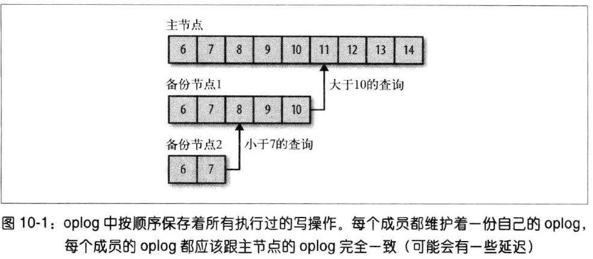
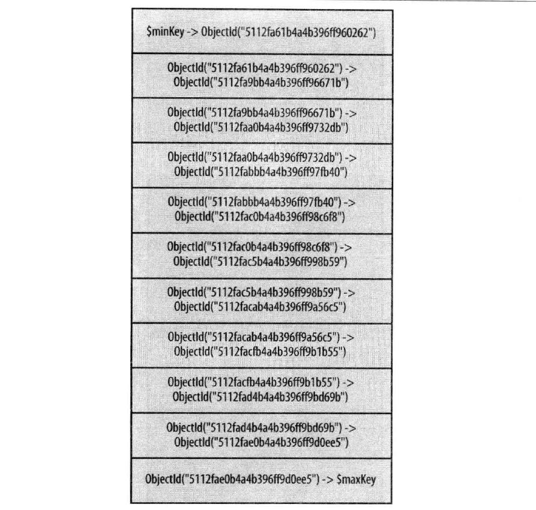

# 高级部分
## 关系
MongoDB 中的**关系表示文档之间的逻辑相关方式**。关系可以通过**内嵌**（Embedded）或**引用**（Referenced）两种方式建模。
这样的**关系可能是 1：1、1：N、N：1，也有可能是 N：N**。

例如，一个用户可能有多个地址，这是一个 1：N 的关系。

```js
// user 文档结构
{
   "_id":ObjectId("52ffc33cd85242f436000001"),
   "name": "Tom Hanks",
   "contact": "987654321",
   "dob": "01-01-1991"
}
// address 文档结构
{
   "_id":ObjectId("52ffc4a5d85242602e000000"),
   "building": "22 A, Indiana Apt",
   "pincode": 123456,
   "city": "Los Angeles",
   "state": "California"
}

// 内嵌关系的建模
{
   "_id":ObjectId("52ffc33cd85242f436000001"),
   "contact": "987654321",
   "dob": "01-01-1991",
   "name": "Tom Benzamin",
   "address": [
      {
         "building": "22 A, Indiana Apt",
         "pincode": 123456,
         "city": "Los Angeles",
         "state": "California"
      },
      {
         "building": "170 A, Acropolis Apt",
         "pincode": 456789,
         "city": "Chicago",
         "state": "Illinois"
      }]
}
```

**该方法会将所有相关数据都保存在一个文档中**，从而易于检索和维护。**缺点是，如果内嵌文档不断增长，会对读写性能造成影响**。

### 引用关系的建模
这是一种设计归一化关系的方法。按照这种方法，这种引用关系也被称作**手动引用**，所有的用户和地址文档都将分别存放，而用户文档会包含一个字段，用来引用地址文档 id 字段。
```js
{
   "_id":ObjectId("52ffc33cd85242f436000001"),
   "contact": "987654321",
   "dob": "01-01-1991",
   "name": "Tom Benzamin",
   "address_ids": [
      ObjectId("52ffc4a5d85242602e000000"),
      ObjectId("52ffc4a5d85242602e000001")
   ]
}
```

数组字段 `address_ids` 含有相应地址的 `ObjectId` 对象。利用这些 `ObjectId`，能够查询地址文档，从而获取地址细节信息。利用这种方法时，需要进行两种查询：
首先从 `user` 文档处获取 `address_ids`，其次从 `address` 集合中获取这些地址。
```js
var result = db.users.findOne({"name":"Tom Benzamin"},{"address_ids":1})
var addresses = db.address.find({"_id":{"$in":result["address_ids"]}})
```

## 数据库引用
上一节中，我们使用引用关系实现了归一化的数据库结构，这种引用关系也被称作**手动引用**，即可以手动地将引用文档的 id 保存在其他文档中。
有些情况下，文档包含其他集合的引用时，我们可以使用**数据库引用**（MongoDB DBRefs）。

如何用数据库引用代替手动引用。假设一个数据库中存储有多个类型的地址（家庭地址、办公室地址、邮件地址，等等），这些地址保存在不同的集合中
（`address_home`、`address_office`、`address_mailing`，等等）。当 `user` 集合的文档引用了一个地址时，它还需要按照地址类型来指定所需要查看的集合。
这种情况下，一个文档引用了许多结合的文档，所以就应该使用 `DBRef`。

### 使用数据库引用
`DBRef` 中有三个字段：
- `$ref` 该字段指定所引用文档的集合。
- `$id` 该字段指定引用文档的 `_id` 字段
- `$db` 该字段是可选的，包含引用文档所在数据库的名称。

假如在一个简单的 `user` 文档中包含着 `DBRef` 字段 `address`，如下所示：
```js
{
   "_id":ObjectId("53402597d852426020000002"),
   "address": {
   "$ref": "address_home",
   "$id": ObjectId("534009e4d852427820000002"),
   "$db": "tutorialspoint"},
   "contact": "987654321",
   "dob": "01-01-1991",
   "name": "Tom Benzamin"
}
```
数据库引用字段 `address` 指定出，引用地址文档位于 `tutorialspoint` 数据库的 `address_home` 集合中，并且它的 `id` 为 `534009e4d852427820000002`。

在由 `$ref` 所指定的集合（本例中为 `address_home`）中，如何动态查找由 `$id` 所确定的文档。
```js
var user = db.users.findOne({"name":"Tom Benzamin"})
var dbRef = user.address
db[dbRef.$ref].findOne({"_id":(dbRef.$id)})
```

## 查询分析
对于衡量数据库及索引设计的效率来说，分析查询是一个很重要的衡量方式。经常使用的查询有 `$explain` 和 `$hint`。

### $explain
`$explain` 操作提供的消息包括：查询消息、查询所使用的索引以及其他的统计信息。

例如：
```js
// 创建索引
db.users.ensureIndex({gender:1,user_name:1})

// 查询
db.users.find({gender:"M"},{user_name:1,_id:0}).explain()

// 输出
{
   "cursor" : "BtreeCursor gender_1_user_name_1",
   "isMultiKey" : false,
   "n" : 1,
   "nscannedObjects" : 0,
   "nscanned" : 1,
   "nscannedObjectsAllPlans" : 0,
   "nscannedAllPlans" : 1,
   "scanAndOrder" : false,
   "indexOnly" : true,
   "nYields" : 0,
   "nChunkSkips" : 0,
   "millis" : 0,
   "indexBounds" : {
      "gender" : [
         [
            "M",
            "M"
         ]
      ],
      "user_name" : [
         [
            {
               "$minElement" : 1
            },
            {
               "$maxElement" : 1
            }
         ]
      ]
   }
}
```

- `indexOnly` 为`true`代表该查询使用了索引。
- `cursor` 字段指定了游标所用的类型。`BTreeCursor` 类型代表了使用了索引并且提供了所用索引的名称。`BasicCursor` 表示进行了完整扫描，没有使用任何索引。
- `n` 代表所返回的匹配文档的数量。
- `nscannedObjects` 表示已扫描文档的总数。
- `nscanned` 所扫描的文档或索引项的总数。

### $hint
`$hint` 操作符**强制索引优化器使用指定的索引运行查询**。这尤其适用于测试带有多个索引的查询性能。比如，下列查询指定了用于该查询的 `gender` 和 `user_name` 字段的索引：
```js
db.users.find({gender:"M"},{user_name:1,_id:0}).hint({gender:1,user_name:1})
```


## Map Reduce
`Map-Reduce`（映射归约）是一种将大量数据压缩成有用的聚合结果的数据处理范式。MongoDB 使用 `mapReduce` 命令来实现映射归约操作。映射归约通常用来处理大型数据。

`mapReduce` 命令的基本格式为：
```js
db.collection.mapReduce(
   function() {emit(key,value);},  //map function
   function(key,values) {return reduceFunction},   //reduce function
   {
      out: collection,
      query: document,
      sort: document,
      limit: number
   }
)
```
**`mapReduce` 函数首先查询集合，然后将结果文档利用 `emit` 函数映射为键值对，然后再根据有多个值的键来简化**。

- `map` 一个 JavaScript 函数，将一个值与键对应起来，并生成键值对。
- `reduce` 一个 JavaScript 函数，用来减少或组合所有拥有同一键的文档。
- `out` 指定映射归约查询结果的位置。
- `query` 指定选择文档所用的选择标准（可选的）。
- `sort` 指定可选的排序标准。
- `limit` 指定返回的文档的最大数量值（可选的）。

### 使用
例如，下面这个存储用户发帖的文档结构。该文档存储用户的用户名（user_name）和发帖状态（status）。
```js
{
   "post_text": "tutorialspoint is an awesome website for tutorials",
   "user_name": "mark",
   "status":"active"
}
```

在 `posts` 集合上使用 `mapReduce` 函数选择所有的活跃帖子，将它们基于用户名组合起来，然后计算每个用户的发帖量。代码如下：
```js
db.posts.mapReduce(
  function() { emit(this.user_id,1); },
  function(key, values) {return Array.sum(values)},
  {
     query:{status:"active"},
     out:"post_total"
  }
)
```

输出：
```js
{
   "result" : "post_total",
   "timeMillis" : 9,
   "counts" : {
      "input" : 4,
      "emit" : 4,
      "reduce" : 2,
      "output" : 2
   },
   "ok" : 1,
}
```
结果显示，只有 4 个文档符合查询条件（`status:"active"`），于是 `map` 函数就生成了 4 个带有键值对的文档，而最终 `reduce` 函数将具有相同键值的映射文档变为了 2 个。

### 查看 mapReduce 查询的结果
使用 `find` 操作符。
```js
db.posts.mapReduce(
   function() { emit(this.user_id,1); },
   function(key, values) {return Array.sum(values)},
      {
         query:{status:"active"},
         out:"post_total"
      }
).find()
```

## 全文检索
### 启用文本搜索
最初的文本搜索只是一种试验性功能，但从 2.6 版本起就成为默认功能了。但如果使用的是之前的 MongoDB，则需要使用下列代码启用文本搜索：
```js
db.adminCommand({setParameter:true,textSearchEnabled:true})
```

### 创建文本索引
```js
db.posts.ensureIndex({post_text:"text"})
```

上面的代码在 `post_text` 字段上创建文本索引，以便搜索帖子文本之内的内容。

在 `post_text` 字段上创建了文本索引，接下来搜索包含 `tutorialspoint` 文本内容的帖子。
```js
db.posts.find({$text:{$search:"tutorialspoint"}})
```

### 删除文本索引
```js
// 找到索引名称
db.posts.getIndexes()

// 删掉
db.posts.dropIndex("post_text_text")
```

## 正则表达式
正则表达式在所有语言当中都是经常会用到的一个功能，可以用来搜索模式或字符串中的单词。MongoDB 也提供了这一功能，使用 $regex 运算符来匹配字符串模式。
MongoDB 使用 PCRE（可兼容 Perl 的正则表达式）作为正则表达式语言。

使用正则表达式不需要使用任何配置或命令。

假如 posts 集合有下面这个文档，它包含着帖子文本及其标签。
```js
{
   "post_text": "enjoy the mongodb articles on tutorialspoint",
   "tags": [
      "mongodb",
      "tutorialspoint"
   ]
}
```

使用下列正则表达式来搜索包含 tutorialspoint 的所有帖子。
```js
db.posts.find({post_text:{$regex:"tutorialspoint"}})

// 或者
db.posts.find({post_text:/tutorialspoint/})
```

### 不区分大小写
要想使搜索不区分大小写，使用 `$options` 参数和值 `$i`。
```js
db.posts.find({post_text:{$regex:"tutorialspoint",$options:"$i"}})
```

### 使用正则表达式来处理数组元素
还可以在数组字段上使用正则表达式。在实现标签的功能时，这尤为重要。假如想搜索标签以 “tutorial” 开始（tutorial、tutorials、tutorialpoint 或 tutorialphp）的帖子，可以使用下列代码：

```js
db.posts.find({tags:{$regex:"tutorial"}})
```

### 优化正则表达式查询
- 如果文档字段已经设置了索引，查询将使用索引值来匹配正则表达式，从而使查询效率相对于扫描整个集合的正则表达式而言大大提高。
- 如果正则表达式为前缀表达式，所有的匹配结果都要在前面带有特殊的前缀字符串。比如，如果正则表达式为 `^tut`，那么查询将搜索所有以 `tut` 开始的字符串。

## ID自增
默认情况下，MongoDB 将 `_id` 字段（使用 12 字节的 `ObjectId`）来作为文档的唯一标识。但在有些情况下，我们希望 `_id` 字段值能够自动增长，而不是固守在 `ObjectId` 值上。

使用 `counters` 集合来程序化地实现该功能。

1. 使用 counters 集合
假设存在下列文档 `products`，我们希望 `_id` 字段值是一个能够自动增长的整数序列（1、2、3、4 …… n）。
```js
{
  "_id":1,
  "product_name": "Apple iPhone",
  "category": "mobiles"
}
```
创建一个 `counters` 集合，其中包含了所有序列字段最后的序列值。
现在，将文档（`productid` 是它的键）插入到 `counters` 集合中：
```js
db.counters.insert({_id:"productid",sequence_value:0})
```
`sequence_value` 字段保存了序列的最后值。

2. 创建一个 `getNextSequenceValue` 函数
创建一个 `getNextSequenceValue` 函数，该函数以序列名为输入，按照 1 的幅度增加序列数，返回更新的序列数。在该例中，序列名称为 `productid`。
```js
function getNextSequenceValue(sequenceName){
   var sequenceDocument = db.counters.findAndModify(
      {
         query:{_id: sequenceName },
         update: {$inc:{sequence_value:1}},
         new:true
      });
   return sequenceDocument.sequence_value;
}
```

3. 使用 `getNextSequenceValue` 函数

```js
db.products.insert({"_id":getNextSequenceValue("productid"),"product_name":"Apple iPhone","category":"mobiles"})
db.products.insert({"_id":getNextSequenceValue("productid"),"product_name":"Samsung S3","category":"mobiles"})
```

## 副本集
生产环境下，把数据库放到一台服务器上是有很大风险的。Mongo 的**复制**功能可以把数据副本保存到多台服务器上。在 Mongo 中，只需要创建**副本集**
就可以使用复制功能了。副本集是一组服务器，一个是主服务器，处理客户端请求，还有多个备份服务器，用于保存数据副本。并且备份服务器可以在主服务器崩溃时
自动选举一个新的主服务器。

副本集中有个比较重要的概念叫做**大多数**（超过一半以上的成员）：**选择主节点时，只有在大多数节点支持时才能继续作为主节点**。写操作被复制到大多数成员时，
这个写操作就是安全的。

如果副本集中有些成员挂了，不会影响“大多数”，**“大多数”是基于副本集的配置计算的**。

假设有一个包含 5 个成员的副本集，3 个成员不可用，2 个正常。那么剩余的 2 个成员无法达到“大多数”的要求，就无法选举出主节点。而且**如果这 2 个成员中有一个是
主节点，这个主节点也会退位**。那么，之后就变成了 2 个备份节点和 3 个不可用节点。

这样的规则是不是弱爆了？明明有两个可用的节点，却不能选举出主节点。为什么？

**为了避免出现多个主节点**。

因为如果 3 个不可用成员不是挂了，可能因为网络问题，造成通信不可达，这种情况下，3 个不可用的节点可能会选举出一个主节点，2 个正常的节点再选举一个主节点，
那么副本集就会出现 2 个主节点。写入数据时，就会发生混乱。

### 推荐的配置
在两个数据中心放置数量相同的成员，在第三个地方放置一个决定胜负的副本集成员。只要任意一个数据中心的服务器可以找到那一台关键的服务器，就可以达到“大多数”的要求。

### 选举机制
当一个本分节点无法与主节点连通时，它就会联系并请求其他副本集成员将自己选举为主节点。其他成员会做几个检查：
1. 自己是否能与主节点连通
2. 希望被选举为主节点的成员数据是否是最新的
3. 有没有优先级更高的成员可以选举为主节点

**每个成员都只能要求自己被选举为主节点**。

### 仲裁者
可以给予每个副本集成员不一样的配置。

Mongo 支持**仲裁者**类型的成员。仲裁者只参与选举，不保存数据，因为有时候数据副本保存太多，浪费资源。只是为了帮助其他成员满足“大多数”的条件。

仲裁者不需要履行 Mongo 服务器的职责，所以可以放在配置比较差的服务器上。可以作为上面说到的那个决定胜负的成员。

**仲裁者只允许有一个**。

**尽可能在副本集中使用奇数个数据成员，不适用仲裁者**。因为如果有三个成员，2 个数据成员，1 个仲裁者，在主节点挂了之后，只剩下一个数据成员，被选举为主节点，
为了数据备份，只能再加入一个数据成员，并复制所有数据副本，复制数据会对服务器造成很大的压力。

### 优先级
一个成员成为主节点的优先级，取值范围 `0~100`。默认是 1。优先级为 0 的成员永远不能成为主节点，这种成员叫做**被动成员**。

优先级越高，就越先被选为主节点。

### 延迟备份节点
可以使用 `slaveDelay` 设置一个延迟备份节点，防止有人不小心删除了主数据库，或者程序 bug 导致数据误删除之类的问题。

**`slaveDelay` 成员要求优先级为 0**。

### 创建索引
备份节点一般不需要与主节点相同的索引，甚至没有索引。如果只是用来数据备份或者离线任务。可以指定 `builgIndexes: false` 这个选项阻止备份节点
创建索引。

**注意指定了 `builgIndexes: false` 这个选项的成员无法恢复为可以创建索引的成员。`builgIndexes: false` 这个选项的成员要求优先级为 0**。

### 同步
MongoDB 的复制功能是使用操作日志 oplog 实现的，操作日志包含了主节点的每一次写操作。oplog 是主节点的 local 数据库中的一个固定集合。备份
节点通过查询这个集合就知道需要进行的复制操作。

每个备份节点要维护自己 oplog，先复制数据，在写入 oplog，记录每一次从主节点复制数据的操作。这样每个成员都可以作为同步源提供给其他成员使用。


如果某个人备份节点挂了，重启后，会自动从 oplog 中最后一个操作开始同步。

oplog 的大小是固定的。如果执行大量的批量操作，oplog 会很快填满。

#### 处理陈旧数据
备份节点远落后于同步源当前操作，那么这个备份节点就是**陈旧**的。比如备份节点曾经停机，或者有太多的读请求，都可能导致节点陈旧。

一个节点陈旧之后，会找到 oplog 足够详尽的成员来同步，如果没有 复合的 oplog，就需啊哟进行完全同步。

为了避免陈旧备份节点，主节点的 oplog 要足够大。

## 分片
**分片**（sharding）是指将数据拆分，将其分散存放在不同的机器上的过程。有时也叫做**分区**（partitioning）。数据分散到不同机器上，
这样服务器可以储存更多的数据，处理更大的负载。

几乎所有的数据库软件都支持**手动分片**。MongoDB 支持**自动分片**，简化系统管理，并且对应用程序，就像在使用一台 MongoDB 服务器。

### 分片集群
Mongo 的分片机制允许创建一个包含多台机器（分片）的集群。将数据子集分散在集群中，每个分片维护一个数据集合的子集。与单机和副本集相比，使用集群架构可以使应用具有
更大的数据处理能力。

> **复制**和**分片**的概念是不一样的，复制是让多台服务器拥有**同样的数据副本**，而每一个**分片都有不同的数据子集**。

#### 何时分片
通常不必太早分片，因为分片会增加部署的复杂度。也不要在系统运行太久后再分片，在一个过载的系统上不停机分片是非常困难的。

分片的作用：
- 增加可用 RAM
- 增加可用磁盘空间
- 减轻单台服务器负载
- 处理更大的吞吐量

分片不可太少，因为由于迁移数据，维护元数据，路由等开销，可能还会造成性能下降。

#### 组件
- **mongos**，数据库集群请求的入口，所有的请求都通过 mongos 进行协调，不需要在应用程序添加一个路由选择器，mongos 自己就是一个请求分发中心，
它**负责把对应的数据请求请求转发到对应的 shard 服务器上**。在生产环境通常有多 mongos 作为请求的入口，防止其中一个挂掉所有的 mongodb 请求都没有办法操作。
- **config server**，配置服务器，存储所有数据库元信息（路由、分片）的配置。
- **Shard**，分片服务器。

#### 配置分片
##### 配置服务器
**配置服务器保存集群和分片的元数据，即各个分片包含哪些数据的信息**。

**创建集群首先要先建立配置服务器，并启用日志功能。每个配置服务器都应该位于单独的物理机上**。

```sh
# config-1
mongod --configsvr --dbpath /var/lib/mongodb -f /var/lib/config/mongod.conf
# config-2
mongod --configsvr --dbpath /var/lib/mongodb -f /var/lib/config/mongod.conf
# config-3
mongod --configsvr --dbpath /var/lib/mongodb -f /var/lib/config/mongod.conf
```
启动 3 台配置服务器， mongos 会向所有配置服务器发送请求，确保每台配置服务器拥有相同的数据。配置服务器不需要太多的资源，它只保存数据的分布表。
所以可以将其部署在分片服务器或者 mongos 服务器上。

`--configsvr` 指定 mongod 为配置服务器，其实只是将 mongod 默认的 27017 端口改为了 27019，把默认的数据目录改为 `/data/configdb`。

为了避免配置服务器全部挂掉，通常也应该对配置服务器的数据进行备份。

##### mongos
3 个配置服务器已运行，启动一个 mongos 进程来做入口。mongos 必须知道配置服务器地址，使用 `--configdb` 来指定：
```sh
mongos --configdb config-1:27019,config-2:27019,config-3:27019 -f /var/lib/mongos.conf
```

mongos 运行在 27017 端口。不需要指定数据目录，因为 mongos 不保存数据。可以启动多个 mongos 进程。

##### 将副本集转化为分片
假设已经有一个副本集，如果没有就初始化一个空的副本集。如果有一个使用中的副本集，该副本集会成为第一个分片。

接下来，mongos 需要知道副本集的名称和副本集成员列表。例如 server-1、server-2、server-3、server-4、server-5 上有一个名为 spock 的
副本集，连接 mongos，并运行：
```sh
> sh.addShard("spock/server-1:27017,server-2:27017,server-4:27017")
```
上面的语句没有指定所有成员，mongos 可以自动检测副本集的所有成员。比如运行 `sh.status()`，可以发现 mongos 已经找到可所有副本集成员
`spock/server-1:27017,server-2:27017,server-3:27017,server-4:27017,server-5:27017`。

副本集名称会作为分片的名称。副本集作为分片添加到集群之后，应用程序就可以从连接副本集改为连接到 mongos。mongos 会将副本集的所有
数据库注册为分片数据库，所有查询会送到新的分片上。

##### 数据分片
除非明确指定归罪，否则 MongoDB 不会自动对数据进行拆分。

假设读数据库 music 中的 artists 集合按照 name 字段分片。
```js
// 数据库 music 启用分片
db.enableSharding("music")

// 对集合分片
sh.shardCollection("music.artists", {"name": 1})
```

**注意，如果对已经存在的集合分片，那么 `name` 字段必须有索引，否则 `shardCollection` 会报错。**如果报错，进先创建索引，
再执行 `shardCollection`。

##### 部署架构
下面是一个常见的部署架构，可以用作参考，机器数量根据自身情况而定。

使用三台服务器，部署三个分片，每个分片三副本。实际上分片数量可以是任意个，试主机性能而定。各个分片之间是完全相互独立的，一个 database 的数据只会落在一个分片上。

- 服务器：`16.187.189.120`、`16.187.189.121`、`16.187.189.122`

部署结构如下表所示：

| `16.187.189.120` | `16.187.189.121` | `16.187.189.122` |
| ---- | ---- | ---- |
| mongos: `27017` | mongos: `27017` | mongos: `27017` |
| config: `27018` | config: `27018`	 | config: `27018` |
| shard01: `27101` | shard01: `27101` | shard01: `27101` |
| shard02: `27102` | shard02: `27102` | shard02: `27102` |
| shard03: `27103` | shard03: `27103` | shard03: `27103` |


[参考文章](https://yq.aliyun.com/articles/625991)

### MongoDB 如何追踪集群数据
MongoDB 将文档分组为**块**（chunk），每个块由给定片键特定范围内的文档组成。一个块只存在一个分片上，所以只需要一个很小的表就可以维护块和分片的映射。

比如，一个用户集合的片键是 `{"age": 1}`，某个块可能是由 age 值为 `3~17` 的文档组成。如果有一个 `{"age": 5}` 的查询，就可以直接路由到 age 值为 `3~17`
的块所在的分片。

如果 age 值为 `3~17` （`3 ≤ age < 17`）的块越来越大，比如我们的应用大部分用户是这个年龄段的学生，那么这个块会被拆分成两个小块，
比如会拆成 `3~11` （3 ≤ age < 11）和 `12~17` （`12 ≤ age < 17`）的块。接着变大，就
接着拆分。

**块与块之间的范围不能有交集**。

**一个文档只属于一个块。就意味着不能使用数组字段作为片键**。因为 MongoDB 会为数组创建多个索引。

**`--nosplit` 可以关闭块的拆分**。

### 均衡器
均衡器负责数据的迁移，周期性的检查分片间是否存在 不均衡，存在的话，就会开始块的迁移。mongos 会扮演均衡器的角色。均衡不会影响 mongos 的正常路由
操作。

### 选择片键
对集合分片时，要选择一个或两个字段来做**片键，用于数据拆分。一旦拥有多个分片，再修改片键几乎不可能，因此，选择合适的片键
非常重要。

#### 升序片键
升序片键类似 “date” 字段或者 ObjectId，是一种随着时间稳定增长的字段。

比如基于 `_id` 分片，集合会根据 `_id` 拆分块。如果创建一个新文档，这个文档会分发到 `ObjectId("5112fae0b4a4b396ff9d0ee5")` 到 `$maxKey` 的块。这个
块叫**最大块**。接下来再插入的文档都在这个最大快中。因为 `_id` 的值在不断增长，比之前的文档的 `_id` 值都大。



这样的分块，**有明显的弊端，就是接下来的所有写请求都会路由到一个分片中。这个最大块是唯一一个不断增长和拆分的块，因为只有它能接收到插入请求。然后数据不断增多，
最大块再不断拆分出新的小块。这会导致数据均衡处理困难，因为所有新块都是同一个分片创建。MongoDB 必须不断将一些块迁移至其他的分片**。


#### 随机分发的片键
随机分发的片键可以使用户名，邮件地址，UDID，MD5 散列值，或者是数据集中其他一些没有规律的键。

数据的随机性意味着，新数据会比较均衡的分发在不同的块中。

弊端是，MongoDB 在随机访问超出 RAM 大小的数据时效率不高。但是如果 RAM 足够，随机分片的键的性能是很好的。

#### 基于位置的片键
基于位置的片键可以使IP，经纬度，或者地址。这里的 “位置” 比较抽象，疏忽会根据 “位置” 分组，所有与该健值比较接近的文档都会被保存在一个块中。

#### 片键策略
##### 散列片键
**散列片键的数据加载速度最快。散列片键可使其他任意键随机分发，如果打算使用升序键，又希望数据随机分发，那么就选择散列片键**。

弊端是无法使用散列片键做指定目标的范围查询。

```sh
# 创建散列索引
> db.users.ensureIndex({"username": "hashed"})

# 集合分片
> sh.shardCollection("app.users", {"username": "hashed"})
```

#### 片键限制
- 片键不可以是数组。
- 文档一旦插入，片键无法修改，要修改，必须先删除文档，因此尽量选择不会被改变的字段。
- 大多数特殊类型的索引不能做片键。特别是地理空间索引。

#### 片键的势
选择一个值会发生变化的键很重要，比如以 "logLevel" 为键，"logLevel" 只拥有 "DEBUG"、"WARN"、"ERROR"、"INFO" 四个值。那么最多只有将数据分为四个
块。

如果一个键的值比较少，又希望用作片键，可以与另一只键一起创建组合片键，比如和 "timestamp"。