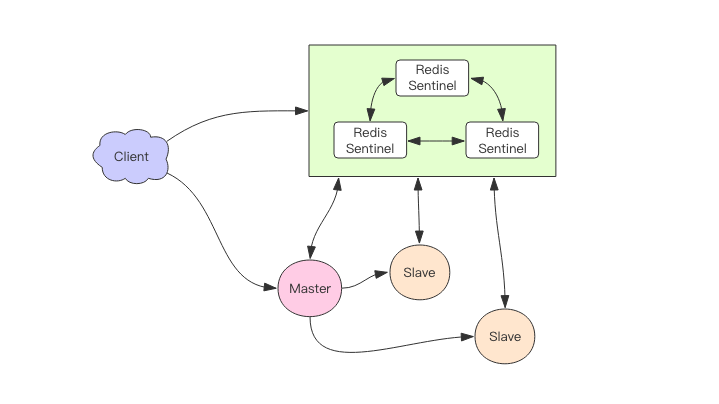
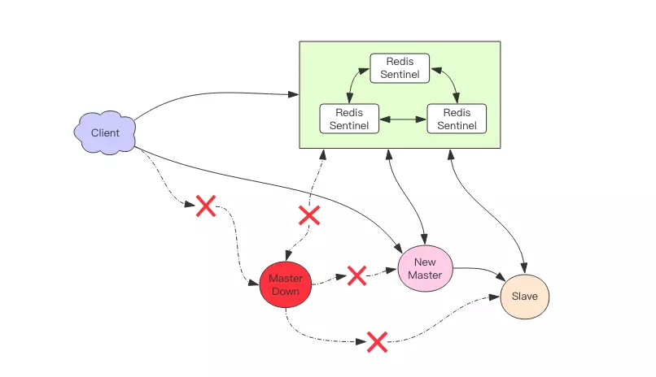

# 集群
## Sentinel
可以将 Redis Sentinel 集群看成是一个 ZooKeeper 集群，它是集群高可用的心脏，它一般是由 `3～5` 个节点组成，这样挂了个别节点集群还可以正常运转。

它负责持续监控主从节点的健康，当主节点挂掉时，自动选择一个最优的从节点切换为主节点。客户端来连接集群时，会首先连接 sentinel，通过 sentinel 来查询主节
点的地址，然后再去连接主节点进行数据交互。当主节点发生故障时，客户端会重新向 sentinel 要地址，sentinel 会将最新的主节点地址告诉客户端。

从这张图中我们能看到主节点挂掉了，原先的主从复制也断开了，客户端和损坏的主节点也断开了。从节点被提升为新的主节点，其它从节点开始和新的主节点建立复制关系。客户端通过新的主节点继续进行交互

Sentinel 会持续监控已经挂掉了主节点，待它恢复后原先挂掉的主节点现在变成了从节点，从新的主节点那里建立复制关系。

## Cluster
Redis 集群是 Redis 提供的分布式数据库方案，集群通过分片来进行数据共享，并提供复制和故障转移功能。

### 槽
Redis 通过分片的方式来保存数据：**集群的整个数据库被分为 16384 个槽（slot）**，集群中的每个节点可以处理 0 个或最多 16384 个槽。

16384 个槽都有节点在处理时，集群处于上线状态，相反的，如果有任何一个槽没有得到处理，那么集群处于下线状态。

槽位的信息存储于每个节点中，当 Redis Cluster 的客户端来连接集群时，它也会得到一份集群的槽位配置信息。这样当客户端要查找某个 `key` 时，
可以直接定位到目标节点。

客户端为了可以直接定位某个具体的 key 所在的节点，它就需要缓存槽位相关信息，这样才可以准确快速地定位到相应的节点。同时因
为槽位的信息可能会存在客户端与服务器不一致的情况，还需要纠正机制来实现槽位信息的校验调整。

RedisCluster 的每个节点会将集群的配置信息持久化到配置文件中，所以必须确保配置文件是可写的，而且尽量不要依靠人工修改配置文件。

### 槽位定位算法
Cluster 默认会对 key 值使用 crc16 算法进行 hash 得到一个整数值，然后用这个整数值对 16384 进行取模来得到具体槽位。

Cluster 还允许用户强制某个 key 挂在特定槽位上，通过在 key 字符串里面嵌入 tag 标记，这就可以强制 key 所挂在的槽位等于 tag 所在的槽位。

### 在集群中执行命令
在对数据库的 16384 个槽都进行了指派之后，集群进入上线状态，客户端可以向集群发送指令了。

当客户端向节点发送与数据库键有关的命令时，接受命令的节点会计算出这个 key 属于哪个槽，并检查这个槽是否指派给了自己：
- 如果 key 所在的槽在当前节点，那么节点直接执行命令。
- 如果 key 所在的槽没有指派给当前节点，那么节点会向客户端返回一个 `MOVED` 错诶，指引客户端转向正确的节点，再次发送之前想要执行的指令。

客户端收到 `MOVED` 指令后，要立即纠正本地的槽位映射表。后续所有 key 将使用新的槽位映射表。

### 迁移
Redis Cluster 提供了工具 `redis-trib` 可以让运维人员手动调整槽位的分配情况，它使用 Ruby 语言进行开发，通过组合各种原生的 Redis Cluster 指令来实现。

Redis 迁移的单位是槽，Redis 一个槽一个槽进行迁移，当一个槽正在迁移时，这个槽就处于中间过渡状态。这个槽在原节点的状态为 `migrating`，
在目标节点的状态为 `importing`，表示数据正在从源流向目标。

迁移工具 `redis-trib` 首先会在源和目标节点设置好中间过渡状态，然后一次性获取源节点槽位的所有 key 列表( `keysinslot` 指令，可以部分获
取)，再挨个 key 进行迁移。每个 key 的迁移过程是以原节点作为目标节点的「客户端」，原节点对当前的 key 执行 `dump` 指令得到序列化内容，然后
通过「客户端」向目标节点发送指令 `restore` 携带序列化的内容作为参数，目标节点再进行反序列化就可以将内容恢复到目标节点的内存中，然后返回「客户端」OK，
原节点「客户端」收到后再把当前节点的 key 删除掉就完成了单个 key 迁移的整个过程。

**迁移过程是同步的，在目标节点执行 `restore` 指令到原节点删除 key 之间，原节点的主线程会处于阻塞状态，直到 key 被成功删除**。

如果迁移过程中突然出现网络故障，整个 slot 的迁移只进行了一半。这时两个节点依旧处于中间过渡状态。待下次迁移工具重新连上时，会提示用户继续进行迁移。

在迁移过程中，客户端访问的流程会有很大的变化：
- 新旧两个节点对应的槽位都存在部分 key 数据。客户端先尝试访问旧节点，如果对应的数据还在旧节点里面，那么旧节点正常处理。
- 如果对应的数据不在旧节点里面，那么有两种可能，要么该数据在新节点里，要么根本就不存在。旧节点不知道是哪种情况，所以它会向客
户端返回一个 `-ASK targetNodeAddr` 的重定向指令。客户端收到这个重定向指令后，先去目标节点执行一个不带任何参
数的 `asking`指令，然后在目标节点再重新执行原先的操作指令。

为什么需要执行一个不带参数的asking指令呢？
因为在迁移没有完成之前，按理说这个槽位还是不归新节点管理的，如果这个时候向目标节点发送该槽位的指令，节点是不认的，它会向客户端返回一个 `-MOVED` 重定向
指令告诉它去源节点去执行。如此就会形成**重定向循环**。`asking` 指令的目标就是打开目标节点的选项，告诉它下一条指令不能不理，而要当成自己的槽位来处理。

### 容错
Redis Cluster 可以为每个主节点设置若干个从节点，单主节点故障时，集群会自动将其中某个从节点提升为主节点。如果某个主节点没有从节点，那么当它发生故障时，集
群将完全处于不可用状态。不过 Redis 也提供了一个参数 `cluster-require-full-coverage` 可以允许部分节点故障，其它节点还可以继续提供对外访问。

### 网络抖动
真实世界的机房网络往往并不是风平浪静的，它们经常会发生各种各样的小问题。比如网络抖动就是非常常见的一种现象，突然之间部分连接变得不可访问，然后很快又恢复正常。

为解决这种问题，Redis Cluster 提供了一种**选项 `cluster-node-timeout`，表示当某个节点持续 `timeout` 的时间失联时，才
可以认定该节点出现故障，需要进行主从切换。如果没有这个选项，网络抖动会导致主从频繁切换 (数据的重新复制)**。

### 槽位迁移感知
如果 Cluster 中某个槽位正在迁移或者已经迁移完了，client 如何能感知到槽位的变化呢？客户端保存了槽位和节点的映射关系表，它需要即时得到更新，才可以正
常地将某条指令发到正确的节点中。

前面提到 Cluster 有两个特殊的指令，一个是 `moved`，一个是 `asking`：
- `moved` 是用来纠正槽位的。如果我们将指令发送到了错误的节点，该节点发现对应的指令槽位不归自己管理，就会将目标节点的地址随同 `moved` 指令回复给客户端通知客户
端去目标节点去访问。这个时候客户端就会刷新自己的槽位关系表，然后重试指令，后续所有打在该槽位的指令都会转到目标节点。
- `asking` 指令是用来临时纠正槽位的。如果当前槽位正处于迁移中，指令会先被发送到槽位所在的旧节点，如果旧节点存在数据，那就直接返回结果了，如果不存在，
那么它可能真的不存在也可能在迁移目标节点上。所以旧节点会通知客户端去新节点尝试一下拿数据，看看新节点有没有。这时候就会给客户端返回一个 `asking error` 携带上
目标节点的地址。客户端收到这个 `asking error` 后，就会去目标节点去尝试。客户端不会刷新槽位映射关系表，因为它只是临时纠正该指令的槽位信息，不影响后续指令。

#### 重试多次
`moved` 和 `asking` 指令都是重试指令，客户端会因为这两个指令多重试一次。读者有没有想过会不会存在一种情况，客户端有可能重试 2 次呢？这种情况是存在的，比
如一条指令被发送到错误的节点，这个节点会先给你一个 `moved` 错误告知你去另外一个节点重试。所以客户端就去另外一个节点重试了，结果刚好这个时候运维人员要对这个槽位进行
迁移操作，于是给客户端回复了一个 `asking` 指令告知客户端去目标节点去重试指令。所以这里客户端重试了 2 次。

在某些特殊情况下，客户端甚至会重试多次，所以客户端的源码里在执行指令时都会有一个循环，然后会设置一个最大重试次数。当重试次数超过这个值时，客户端会直接向业务层抛出异常。

### 集群变更感知
当服务器节点变更时，客户端应该即时得到通知以实时刷新自己的节点关系表。那客户端是如何得到通知的呢？这里要分 2 种情况：
1. 目标节点挂掉了，客户端会抛出一个 `ConnectionError`，紧接着会随机挑一个节点来重试，这时被重试的节点会通过 `moved error` 告知目标槽位被分配到的新的节点地址。
2. 运维手动修改了集群信息，将 `master` 切换到其它节点，并将旧的 `master` 移除集群。这时打在旧节点上的指令会收到一个 `ClusterDown` 的错误，告知当前节点所在
集群不可用 (当前节点已经被孤立了，它不再属于之前的集群)。这时客户端就会关闭所有的连接，清空槽位映射关系表，然后向上层抛错。待下一条指令过来时，就会重新尝试初始化节点信息。