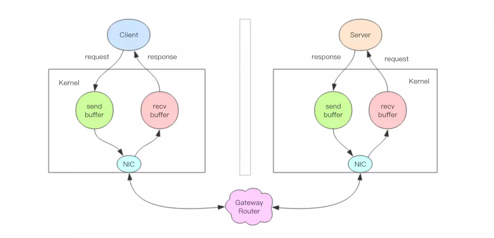

# 管道
Redis 管道 (Pipeline) 本身并不是 Redis 服务器直接提供的技术，这个技术本质上是由客户端提供的，跟服务器没有什么直接的关系。

## Redis 的消息交互
当我们使用客户端对 Redis 进行一次操作时，客户端将请求传送给服务器，服务器处理完毕后，再将响应回复给客户端。这要花费一个网络数据包来回的时间。

如果连续执行多条指令，那就会花费多个网络数据包来回的时间。

## 管道本质

上图就是一个完整的请求交互流程图。我用文字来仔细描述一遍：

1. 客户端进程调用 `write` 将消息写到操作系统内核为套接字分配的发送缓冲 `send buffer`。
2. 客户端操作系统内核将发送缓冲的内容发送到网卡，网卡硬件将数据通过「网际路由」送到服务器的网卡。
3. 服务器操作系统内核将网卡的数据放到内核为套接字分配的接收缓冲 `recv buffer`。
4. 服务器进程调用 `read` 从接收缓冲中取出消息进行处理。
5. 服务器进程调用 `write` 将响应消息写到内核为套接字分配的发送缓冲 `send buffer`。
6. 服务器操作系统内核将发送缓冲的内容发送到网卡，网卡硬件将数据通过「网际路由」送到客户端的网卡。
7. 客户端操作系统内核将网卡的数据放到内核为套接字分配的接收缓冲 `recv buffer`。
8. 客户端进程调用 `read` 从接收缓冲中取出消息返回给上层业务逻辑进行处理。
9. 结束。

我们开始以为 `write` 操作是要等到对方收到消息才会返回，但实际上不是这样的。`write` 操作只负责将数据写到本地操作系统内核的发送缓冲然后就返回了。剩下的事交给操作系统内核异
步将数据送到目标机器。但是如果发送缓冲满了，那么就需要等待缓冲空出空闲空间来，这个就是写操作 IO 操作的真正耗时。

我们开始以为 `read` 操作是从目标机器拉取数据，但实际上不是这样的。`read` 操作只负责将数据从本地操作系统内核的接收缓冲中取出来就了事了。但是如果缓冲是空的，
那么就需要等待数据到来，这个就是读操作 IO 操作的真正耗时。

所以对于 `value = redis.get(key)` 这样一个简单的请求来说，`write` 操作几乎没有耗时，直接写到发送缓冲就返回，而 `read` 就会比较耗时了，因为它要等待消息经过网络路由
到目标机器处理后的响应消息,再回送到当前的内核读缓冲才可以返回。这才是一个网络来回的真正开销。

而对于管道来说，连续的 `write` 操作根本就没有耗时，之后第一个 `read` 操作会等待一个网络的来回开销，然后所有的响应消息就都已经回送到内核的读缓冲了，后续的 `read` 操作直接
就可以从缓冲拿到结果，瞬间就返回了。
