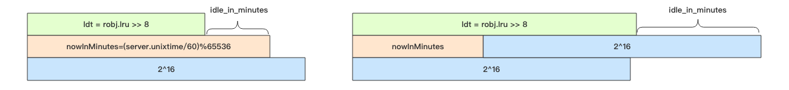

# Redis 的过期策略和内存淘汰机制

在日常开发中，我们使用 Redis 存储 `key` 时通常会设置一个过期时间，但是 Redis 是怎么删除过期的 `key`，而且 Redis 是单线程的，
删除 `key` 过于频繁会不会造成阻塞。要搞清楚这些，就要了解 Redis 的过期策略和内存淘汰机制。

Redis 采用的是**定期删除**加**懒惰删除**策略。懒惰删除就是在客户端访问这个 key 的时候，redis 对 key 的过期时间进行检查，如果过期了
就立即删除。**定时删除是集中处理，惰性删除是零散处理**。

## 定期删除策略
Redis 会将每个**设置了过期时间的 `key` 放入到一个独立的字典**中，默认每 `100ms` 进行一次过期扫描：
1. 随机抽取 `20` 个 `key`
2. 删除这 `20` 个 `key` 中过期的 `key`
3. 如果过期的 `key` 比例超过 `1/4`，就重复步骤 `1`，继续删除。

之所以不扫描所有的 `key`，是因为 Redis 是单线程，全部扫描会导致线程卡死。

而且为了防止每次扫描过期的 `key` 比例都超过 `1/4`，导致不停循环卡死线程，Redis 为每次扫描添加了**上限时间**，默认是 `25ms`。


### 如果一个大型的 Redis 实例中所有的 key 在同一时间过期了，会出现怎样的结果？
大量的 key 在同一时间过期，那么 Redis 会持续扫描过期字典 (循环多次)，直到过期字典中过期的 key 变得稀疏，才会停止 (循环次数明显下降)。
这会导致线上读写请求出现明显的卡顿现象。导致这种卡顿的另外一种原因是内存管理器需要频繁回收内存页，这也会产生一定的 CPU 消耗。

而且，如果客户端将请求超时时间设置的比较短，比如 10ms，但是请求以为过期扫描导致至少等待 25ms 后才会进行处理，那么就会出现大量的请求因为
超时而关闭，业务端就会出现很多异常。这时你还无法从 Redis 的 `slowlog` 中看到慢查询记录，因为慢查询指的是逻辑处理过程慢，不包含等待时间。

所以要避免大批量的 key 同时过期，可以给过期时间设置一个随机范围，分散过期处理的压力。

### 从库的过期策略
从库不会进行过期扫描，从库对过期的处理是被动的。主库在 key 到期时，会在 AOF 文件里增加一条 `del` 指令，同步到所有的从库，从库通过执行
这条 `del` 指令来删除过期的 key。

因为指令同步是异步进行的，所以主库过期的 key 的 `del` 指令没有及时同步到从库的话，会出现主从数据的不一致。

## 内存淘汰机制
当 Redis 内存超出物理内存限制时，内存的数据会开始和磁盘产生频繁的交换 (swap)。交换会让 Redis 的性能急剧下降，对于 Redis 来说，这样
龟速的存取效率基本上等于不可用。

Redis 为了限制最大使用内存，提供了配置参数 `maxmemory`，可以在 `redis.conf` 中配置。当内存超出 `maxmemory`，Redis 提供了几种
策略（maxmemory-policy）让用户选择：
- `noeviction`：当内存超出 `maxmemory`，写入请求会报错，但是删除和读请求可以继续。（这个是默认的策略）。
- `allkeys-lru`：当内存超出 `maxmemory`，在所有的 `key` 中，移除最少使用的 `key`。
- `allkeys-random`：当内存超出 `maxmemory`，在所有的 `key` 中，随机移除某个 `key`。（应该没人用吧）
- `volatile-lru`：当内存超出 `maxmemory`，在设置了过期时间 `key` 的字典中，移除最少使用的 `key`。
- `volatile-random`：当内存超出 `maxmemory`，在设置了过期时间 `key` 的字典中，随机移除某个` key`。
- `volatile-ttl`：当内存超出 `maxmemory`，在设置了过期时间 `key` 的字典中，优先移除 `ttl` 小的。

volatile-xxx 策略只会针对带过期时间的 key 进行淘汰，allkeys-xxx 策略会对所有的 key 进行淘汰。如果只是拿 Redis 做缓存，那应该使
用 allkeys-xxx，客户端写缓存时不必携带过期时间。如果还想同时使用 Redis 的持久化功能，那就使用 volatile-xxx 策略，这样可以保留没
有设置过期时间的 key，它们是永久的 key 不会被 LRU 算法淘汰。

### 近似 LRU 算法

Redis 使用的并不是完全 `LRU` 算法。不使用 `LRU` 算法，是为了节省内存，Redis 采用的是随机 `LRU` 算法，Redis 为每一个 `key` 增加了
一个 24 bit 的字段，用来记录这个 `key` 最后一次被访问的时间戳。**注意 Redis 的 `LRU` 淘汰策略是懒惰处理**，也就是不会主动执行淘汰
策略，当 Redis 执行写操作时，发现内存超出 `maxmemory`，就会执行 `LRU` 淘汰算法。这个算法就是随机采样出 `5` (默认值)个 `key`，然后移
除最旧的 `key`，如果移除后内存还是超出 `maxmemory`，那就继续随机采样淘汰，直到内存低于 `maxmemory` 为止。

如何采样就是看 `maxmemory-policy` 的配置，如果是 `allkeys` 就是从所有的 key 字典中随机，如果是 `volatile` 就从带过期时间的 key 字
典中随机。每次采样多少个 key 看的是 `maxmemory_samples` 的配置，默认为 5。

### LFU
Redis 4.0 里引入了一个新的淘汰策略 —— LFU（Least Frequently Used） 模式，作者认为它比 LRU 更加优秀。

LFU 表示按最近的访问频率进行淘汰，它比 LRU 更加精准地表示了一个 key 被访问的热度。

如果一个 key 长时间不被访问，只是刚刚偶然被用户访问了一下，那么在使用 LRU 算法下它是不容易被淘汰的，因为 LRU 算法认为当前这个 key 是
很热的。而 LFU 是需要追踪最近一段时间的访问频率，如果某个 key 只是偶然被访问一次是不足以变得很热的，它需要在近期一段时间内被访问很多
次才有机会被认为很热。

#### Redis 对象的热度
Redis 的所有对象结构头中都有一个 24 bit 的字段，这个字段用来记录对象的**热度**。
```c
// redis 的对象头
typedef struct redisObject {
    unsigned type:4; // 对象类型如 zset/set/hash 等等
    unsigned encoding:4; // 对象编码如 ziplist/intset/skiplist 等等
    unsigned lru:24; // 对象的「热度」
    int refcount; // 引用计数
    void *ptr; // 对象的 body
} robj;
```

#### LRU 模式
在 LRU 模式下，`lru` 字段存储的是 Redis 时钟 `server.lruclock`，Redis 时钟是一个 24 bit 的整数，默认是 Unix 时间戳对 `2^24` 取
模的结果，大约 97 天清零一次。当某个 key 被访问一次，它的对象头的 `lru` 字段值就会被更新为 `server.lruclock`。

#### LFU 模式
在 LFU 模式下，`lru` 字段 24 个 bit 用来存储两个值，分别是 `ldt(last decrement time)` 和 `logc(logistic counter)`。



`logc` 是 8 个 `bit`，用来存储访问频次，因为 8 个 `bit` 能表示的最大整数值为 255，存储频次肯定远远不够，所以这 8 个 `bit` 存储的
是频次的对数值，并且这个值还会随时间衰减。如果它的值比较小，那么就很容易被回收。**为了确保新创建的对象不被回收，新对象的这 8 个 `bit` 会
初始化为一个大于零的值，默认是 `LFU_INIT_VAL=5`**。

`ldt` 是 16 个位，用来存储上一次 `logc` 的更新时间，因为只有 16 位，所以精度不可能很高。它取的是分钟时间戳对 2^16 进行取模，大约每
隔 45 天就会折返。同 LRU 模式一样，我们也可以使用这个逻辑计算出对象的空闲时间，只不过精度是分钟级别的。图中的 `server.unixtime` 是
当前 redis 记录的系统时间戳，和 `server.lruclock` 一样，它也是每毫秒更新一次。

#### 启用 LFU
Redis 4.0 给淘汰策略配置参数 maxmemory-policy 增加了 2 个选项，
- `volatile-lfu`：对带过期时间的 key 执行 lfu 淘汰算法
- `allkeys-lfu`：对所有的 key 执行 lfu 淘汰算法

使用 `object freq` 指令获取对象的 lfu 计数值：
```sh
> config set maxmemory-policy allkeys-lfu
OK
> set codehole yeahyeahyeah
OK
// 获取计数值，初始化为 LFU_INIT_VAL=5
> object freq codehole
(integer) 5
// 访问一次
> get codehole
"yeahyeahyeah"
// 计数值增加了
> object freq codehole
(integer) 6
```

#### 为什么 Redis 要缓存系统时间戳？
因为每一次获取系统时间戳都是一次系统调用。系统调用相对来说是比较费时间的，作为单线程的 Redis 表示承受不起，所以它需要对时间进行缓存，获
取时间都直接从缓存中直接拿。

## 懒惰删除

### Redis 为什么要懒惰删除(lazy free)？
删除指令 `del` 会直接释放对象的内存，大部分情况下，这个指令非常快，没有明显延迟。不过如果删除的 key 是一个非常大的对象，比如一个包
含了千万元素的 `hash`，又或者在使用 `FLUSHDB` 和 `FLUSHALL` 删除包含大量键的数据库时，那么删除操作就会导致线程卡顿。

redis 4.0 引入了 `lazyfree` 的机制，它可以将删除键或数据库的操作放在后台线程里执行， 从而尽可能地避免服务器阻塞。

### unlink
`unlink` 指令，它能对删除操作进行懒处理，丢给后台线程来异步回收内存。
```sh
> unlink key
OK
```

### flush
`flushdb` 和 `flushall` 指令，用来清空数据库，这也是极其缓慢的操作。Redis 4.0 同样给这两个指令也带来了异步化，在指令后面增
加 `async` 参数就可以扔给后台线程慢慢处理。

```sh
> flushall async
OK
```

### 异步队列
主线程将对象的引用从有效数据中删除后，会将这个 key 的内存回收操作包装成一个任务，塞进异步任务队列，后台线程会从这个异步队列中取任务。任
务队列被主线程和异步线程同时操作，所以必须是一个线程安全的队列。

不是所有的 `unlink` 操作都会延后处理，如果对应 key 所占用的内存很小，延后处理就没有必要了，这时候 Redis 会将对应的 key 内存立即回收，
跟 `del` 指令一样。

### AOF Sync
Redis 需要每秒一次(可配置)同步 AOF 日志到磁盘，确保消息尽量不丢失，需要调用 sync 函数，这个操作会比较耗时，会导致主线程的效率下降，
所以 Redis 也将这个操作移到异步线程来完成。执行 AOF Sync 操作的线程是一个独立的异步线程，它也有一个属于自己的任务队列，队列里只用
来存放 AOF Sync 任务。

### 更多异步删除点
Redis 回收内存除了 `del` 指令和 `flush` 之外，还会存在 key 的过期、LRU 淘汰、`rename` 指令以及从库全量同步时接受完 rdb 文件后会
立即进行的 `flush` 操作。

Redis4.0 为这些删除点也带来了异步删除机制，打开这些点需要额外的配置选项。

- `slave-lazy-flush` 从库接受完 rdb 文件后的 `flush` 操作
- `lazyfree-lazy-eviction` 内存达到 `maxmemory` 时进行淘汰
- `lazyfree-lazy-expire` key 过期删除
- `lazyfree-lazy-server-del` `rename` 指令删除 `destKey`
