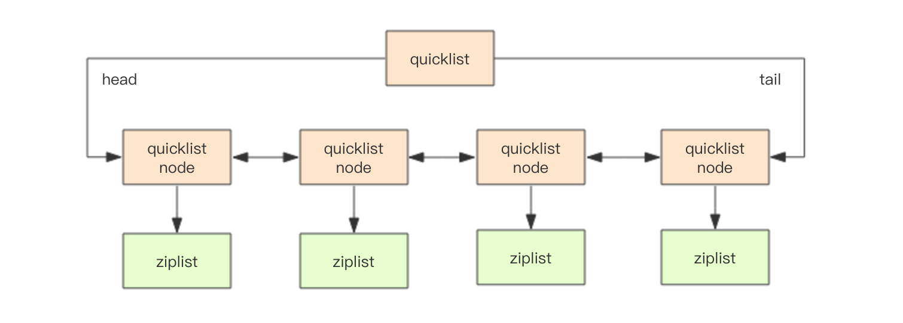
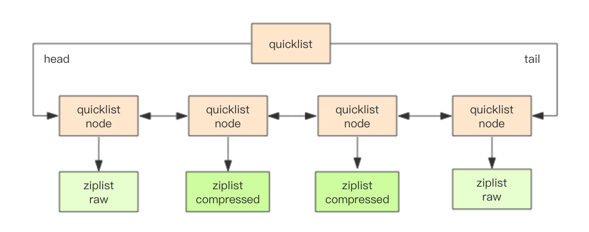

# 快速列表

Redis 早期版本存储 list 列表数据结构使用的是压缩列表 ziplist 和普通的双向链表 linkedlist，当元素少时用 ziplist，元素多时
用 linkedlist。

考虑到链表的附加空间相对太高，prev 和 next 指针就要占去 16 个字节 (64bit 系统的指针是 8 个字节)，另外每个节点的内存都是单独分配，会
加剧内存的碎片化，影响内存管理效率。后续版本对列表数据结构进行了改造，使用 quicklist 代替了 ziplist 和 linkedlist。

```sh
> rpush codehole go java python
(integer) 3
> debug object codehole
Value at:0x7fec2dc2bde0 refcount:1 encoding:quicklist serializedlength:31 lru:6101643 lru_seconds_idle:5 ql_nodes:1 ql_avg_node:3.00 ql_ziplist_max:-2 ql_compressed:0 ql_uncompressed_size:29
```

quicklist 是 ziplist 和 linkedlist 的混合体，它将 linkedlist 按段切分，每一段使用 ziplist 来紧凑存储，多个 ziplist 之间使用
双向指针串接起来。



```c
struct ziplist {
    ...
}
struct ziplist_compressed {
    int32 size;
    byte[] compressed_data;
}
struct quicklistNode {
    quicklistNode* prev;
    quicklistNode* next;
    ziplist* zl; // 指向压缩列表
    int32 size; // ziplist 的字节总数
    int16 count; // ziplist 中的元素数量
    int2 encoding; // 存储形式 2bit，原生字节数组还是 LZF 压缩存储
    ...
}
struct quicklist {
    quicklistNode* head;
    quicklistNode* tail;
    long count; // 元素总数
    int nodes; // ziplist 节点的个数
    int compressDepth; // LZF 算法压缩深度
    ...
}
```

Redis 还会对 ziplist 进行压缩存储，使用 LZF 算法压缩，可以选择压缩深度。

## 每个 ziplist 存多少元素
quicklist 内部默认单个 ziplist 长度为 8k 字节，超出了这个字节数，就会新起一个 ziplist。ziplist 的长度由配置
参数 `list-max-ziplist-size` 决定。

```sh
# Lists are also encoded in a special way to save a lot of space.
# The number of entries allowed per internal list node can be specified
# as a fixed maximum size or a maximum number of elements.
# For a fixed maximum size, use -5 through -1, meaning:
# -5: max size: 64 Kb  <-- not recommended for normal workloads
# -4: max size: 32 Kb  <-- not recommended
# -3: max size: 16 Kb  <-- probably not recommended
# -2: max size: 8 Kb   <-- good
# -1: max size: 4 Kb   <-- good
# Positive numbers mean store up to _exactly_ that number of elements
# per list node.
# The highest performing option is usually -2 (8 Kb size) or -1 (4 Kb size),
# but if your use case is unique, adjust the settings as necessary.
list-max-ziplist-size -2
```

## 压缩深度



quicklist 默认的压缩深度是 0，也就是不压缩。压缩的深度由配置参数 `list-compress-depth` 决定。为了支持快速的 push/pop 操作，
quicklist 的首尾两个 ziplist 不压缩，此时深度就是 1。如果深度为 2，就表示 quicklist 的首尾第一个 ziplist 以及首尾第二个 ziplist 
都不压缩。