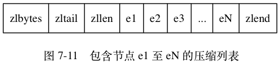

# 小对象压缩

如果 Redis 内部管理的集合数据结构很小，它就会使用紧凑存储形式压缩存储。

比如 HashMap 结构，如果内部元素比较少，使用散列表反而浪费空间，不如直接使用数组进行存储，需要查找时，因为元素少进行遍历也很快，甚至
可以比 HashMap 本身的查找还要快。

## ziplist

Redis 的 ziplist 是一个紧凑的 byte 数组结构，如下图，每个元素之间都是紧挨着的。


如果 ziplist 存储的是 hash 结构，那么 key 和 value 会作为两个 entry 相邻存在一起。

```sh
127.0.0.1:6379> hset hello a 1
(integer) 1
127.0.0.1:6379> hset hello b 2
(integer) 1
127.0.0.1:6379> hset hello c 3
(integer) 1
127.0.0.1:6379> object encoding hello
"ziplist"
```

如果 ziplist 存储的是 zset，那么 value 和 score 会作为两个 entry 相邻存在一起。
```sh
127.0.0.1:6379> zadd world 1 a
(integer) 1
127.0.0.1:6379> zadd world 2 b
(integer) 1
127.0.0.1:6379> zadd world 3 c
(integer) 1
127.0.0.1:6379> object encoding world
"ziplist"
```

## intset

当 set 集合容纳的**元素都是整数并且元素个数较小**时，Redis 会使用 intset 来存储结合元素。intset 是紧凑的数组结构，同时
支持 16 位、32 位和 64 位整数。

```c
struct intset<T> {
    int32 encoding; // 决定整数位宽是 16 位、32 位还是 64 位
    int32 length; // 元素个数
    int<T> contents; // 整数数组，可以是 16 位、32 位和 64 位
}
```


如果整数可以用 uint16 表示，那么 intset 的元素就是 16 位的数组，如果新加入的整数超过了 uint16 的表示范围，那么就使用 uint32 表示，
如果新加入的元素超过了 uint32 的表示范围，那么就使用 uint64 表示，Redis 支持 set 集合动态从 uint16 升级到 uint32，再升级
到 uint64。


```sh
127.0.0.1:6379> sadd hello 1 2 3
(integer) 3
127.0.0.1:6379> object encoding hello
"intset"
```

**如果 set 里存储的是字符串，那么 sadd 立即升级为 hashtable 结构**。
```sh
127.0.0.1:6379> sadd hello yes no
(integer) 2
127.0.0.1:6379> object encoding hello
"hashtable"
```

**存储界限** 当集合对象的元素不断增加，或者某个 value 值过大，这种小对象存储也会被升级为标准结构。Redis 规定在小对象存储结构的限制
条件如下：
```sh
hash-max-ziplist-entries 512  # hash 的元素个数超过 512 就必须用标准结构存储
hash-max-ziplist-value 64  # hash 的任意元素的 key/value 的长度超过 64 就必须用标准结构存储
list-max-ziplist-entries 512  # list 的元素个数超过 512 就必须用标准结构存储
list-max-ziplist-value 64  # list 的任意元素的长度超过 64 就必须用标准结构存储
zset-max-ziplist-entries 128  # zset 的元素个数超过 128 就必须用标准结构存储
zset-max-ziplist-value 64  # zset 的任意元素的长度超过 64 就必须用标准结构存储
set-max-intset-entries 512  # set 的整数元素个数超过 512 就必须用标准结构存储
```

## ziplist 内部实现
Redis 为了节约内存空间使用，zset 和 hash 容器对象在元素个数较少的时候，采用压缩列表 (ziplist) 进行存储。

```c
struct ziplist<T> {
    int32 zlbytes; // 整个压缩列表占用字节数
    int32 zltail_offset; // 最后一个元素距离压缩列表起始位置的偏移量，用于快速定位到最后一个节点
    int16 zllength; // 元素个数
    T[] entries; // 元素内容列表，挨个挨个紧凑存储
    int8 zlend; // 标志压缩列表的结束，值恒为 0xFF
}
```

`ztail_offset` 这个字段是为了支持双向遍历，用来快速定位到最后一个元素，然后倒着遍历。

entry 块随着容纳的元素类型不同，也会有不一样的结构。
```c
struct entry {
    int<var> prevlen; // 前一个 entry 的字节长度
    int<var> encoding; // 元素类型编码
    optional byte[] content; // 元素内容
}
```

- prevlen 字段 **记录了压缩列表中前一个 entry 节点的长度** ，当压缩列表倒着遍历时，需要通过这个字段来快速定位到下一个元素的位置。
它是一个变长的整数，当字符串长度小于 254(0xFE) 时，使用一个字节表示；如果达到或超出 254(0xFE) 那就使用 5 个字节来表示。第一个字节
是 0xFE(254)，剩余四个字节表示字符串长度。你可能会觉得用 5 个字节来表示字符串长度，是不是太浪费了。我们可以算一下，当字符串长度比
较长的时候，其实 5 个字节也只占用了不到 `(5/(254+5))<2%` 的空间。
- encoding 字段存储了元素内容的编码类型信息，ziplist 通过这个字段来决定后面的 content 内容的形式。Redis 通过这个字段的前缀位来
识别具体存储的数据形式：
  - `00xxxxxx` 最大长度位 63 的短字符串，后面的 6 个位存储字符串的位数，剩余的字节就是字符串的内容。
  - `01xxxxxx xxxxxxxx` 中等长度的字符串，后面 14 个位来表示字符串的长度，剩余的字节就是字符串的内容。
  - `10000000 aaaaaaaa bbbbbbbb cccccccc dddddddd` 特大字符串，需要使用额外 4 个字节来表示长度。第一个字节前缀是10，剩余 6 位
  没有使用，统一置为零。后面跟着字符串内容。不过这样的大字符串是没有机会使用的，压缩列表通常只是用来存储小数据的。
  - `11000000` 表示 int16，后跟两个字节表示整数。
  - `11010000` 表示 int32，后跟四个字节表示整数。
  - `11100000` 表示 int64，后跟八个字节表示整数。
  - `11110000` 表示 int24，后跟三个字节表示整数。
  - `11111110` 表示 int8，后跟一个字节表示整数。
  - `11111111` 表示 ziplist 的结束，也就是 zlend 的值 0xFF。
  - `1111xxxx` 表示极小整数，xxxx 的范围只能是 (0001~1101), 也就是 1~13，因为 0000、1110、1111 都被占用了。读取到的 value 需
  要将 xxxx 减 1，也就是整数 0~12 就是最终的 value。
- content 字段在结构体中定义为 optional 类型，表示这个字段是可选的，对于很小的整数而言，它的内容已经内联到 encoding 字段的尾部了。

## 增加元素
因为 ziplist 都是紧凑存储，没有冗余空间 (对比一下 Redis 的字符串结构)。意味着插入一个新的元素就需要调用 realloc 扩展内存。取决
于内存分配器算法和当前的 ziplist 内存大小，realloc 可能会重新分配新的内存空间，并将之前的内容一次性拷贝到新的地址，也可能在原有的地
址上进行扩展，这时就不需要进行旧内容的内存拷贝。

如果 ziplist 占据内存太大，重新分配内存和拷贝内存就会有很大的消耗。所以 ziplist 不适合存储大型字符串，存储的元素也不宜过多。

### 连锁更新
考虑这样一种情况： 在一个压缩列表中， 有多个连续的、长度介于 250 字节到 253 字节之间的节点 e1 至 eN ：


e1 至 eN 的所有节点的长度都小于 254 字节，所以记录这些节点的长度只需要 1 字节长的 `prevlen` 属性，
换句话说， e1 至 eN 的所有节点的 `prevlen` 属性都是 1 字节长的。

如果将一个长度大于等于 254 字节的新节点 new 设置为压缩列表的表头节点，那么 new 将成为 e1 的前置节点，因为 e1 的 `prevlen` 属
性仅长 1 字节，它没办法保存新节点 new 的长度，所以程序将对压缩列表执行空间重分配操作，并将 e1 节点的 `prevlen` 属性从原来的 1 字节
长扩展为 5 字节长。

e1 原本的长度介于 250 字节至 253 字节之间， 在为 `prevlen` 属性新增四个字节的空间之后，e1 的长度就变成了介于 254 字节至 257 字节
之间，由于 e1 的长度变长了，长度导致 e2 节点的 `prevlen` 属性也要从原来的 1 字节长扩展为 5 字节长，否则 1 字节长的 `prevlen` 属性
是没办法保存。

扩展 e1 引发了对 e2 的扩展，扩展 e2 也会引发对 e3 的扩展，直到 eN 为止。

Redis 将这种在特殊情况下产生的连续多次空间扩展操作称之为**连锁更新**。

连锁更新的复杂度较高， 但它真正造成性能问题的几率是很低的：
- 首先， 压缩列表里要恰好有多个连续的、长度介于 250 字节至 253 字节之间的节点， 连锁更新才有可能被引发， 在实际中， 这种情况并不多见；
- 其次， 即使出现连锁更新， 但只要被更新的节点数量不多， 就不会对性能造成任何影响： 比如，对三五个节点进行连锁更新是绝对不会影响
性能的；