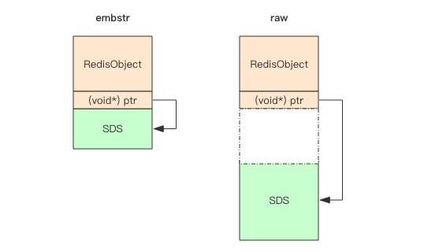

# 简单动态字符串
Redis 没有直接使用 C 语言传统的字符串表示（以空字符结尾的字符数组，以下简称 C 字符串），而是自己构建了一种名为**简单
动态字符串**（simple dynamic string，SDS）的抽象类型， 并将 **SDS** 用作 Redis 的默认字符串表示。内部结构实现上类
似于 Java 的 ArrayList。

Redis 中， C 字符串只会作为字符串字面量（string literal），用在一些无须对字符串值进行修改的地方，比如打印日志：
```c
redisLog(REDIS_WARNING,"Redis is now ready to exit, bye bye...");
```

一个可以被修改的字符串值时，Redis 就会使用 SDS 来表示字符串值：比如在 Redis 的数据库里面，包含字符串值的键值对在底层都是由 SDS 实现的。
```sh
redis> SET msg "hello world"
OK
```
其中：
- 键值对的**键是一个字符串对象**，对象的底层实现是一个保存着字符串 "msg" 的 SDS 。
- 键值对的**值也是一个字符串对象**，对象的底层实现是一个保存着字符串 "hello world" 的 SDS。

又比如：
```sh
redis> RPUSH fruits "apple" "banana" "cherry"
(integer) 3
```
其中：
- 键值对的键是一个字符串对象，对象的底层实现是一个保存了字符串 "fruits" 的 SDS 。
- 键值对的值是一个列表对象，列表对象包含了三个字符串对象，这三个字符串对象分别由三个 SDS 实现：
第一个 SDS 保存着字符串 "apple" ， 第二个 SDS 保存着字符串 "banana" ， 第三个 SDS 保存着字符串 "cherry"。

**AOF 模块中的 AOF 缓冲区， 以及客户端状态中的输入缓冲区， 都是由 SDS 实现的**。

## SDS 与 C 字符串的区别
### 常数复杂度获取字符串长度
C 字符串并不记录自身的长度信息，所以为了获取一个 C 字符串的长度，程序必须遍历整个字符串，对遇到的每个字符进行计数，直到遇到代表字符串
结尾的空字符为止，这个操作的复杂度为 `O(N)`。

SDS 在 `len` 属性中记录了 SDS 本身的长度，所以获取一个 SDS 长度的复杂度仅为 `O(1)`。

```java
struct SDS<T> {
  T capacity; // 数组容量
  T len; // 数组长度
  byte flags; // 特殊标识位，不理睬它
  byte[] content; // 数组内容
}
```

使用 SDS 确保了获取字符串长度的工作不会成为 Redis 的性能瓶颈。

比如说，对一个非常长的字符串键反复执行 `STRLEN` 命令，也不会对系统性能造成任何影响，因为 `STRLEN` 命令的复杂度仅为 `O(1)`。

### 杜绝缓冲区溢出
**C 字符串不记录自身长度带来的另一个问题是容易造成缓冲区溢出**（buffer overflow）。

例如，`<string.h>/strcat` 函数可以将 `src` 字符串中的内容拼接到 `dest` 字符串的末尾：
```c
char *strcat(char *dest, const char *src);
```
因为 C 字符串不记录自身的长度，所以 `strcat` 假定用户在执行这个函数时，已经为 `dest` 分配了足够多的内存， 可以容纳 `src` 字符串中的
所有内容，而一旦这个假定不成立时，就会产生缓冲区溢出。

SDS 的空间分配策略完全杜绝了发生缓冲区溢出的可能性：当 SDS API 需要对 SDS 进行修改时， API 会先检查 SDS 的空间是否满足修改所需的要求，
如果不满足的话，API 会自动将 SDS 的空间扩展至执行修改所需的大小，然后才执行实际的修改操作，所以使用 SDS 既不需要手动修改 SDS 的空间
大小，也不会出现前面所说的缓冲区溢出问题。

比如 SDS 的 API 中的 `sdscat` 函数，它可以将一个 C 字符串拼接到给定 SDS 所保存的字符串的后面，但是在执行拼接操作之前，`sdscat` 会
先检查给定 SDS 的空间是否足够，如果不够的话，`sdscat` 就会先扩展 SDS 的空间， 然后才执行拼接操作。

### 减少修改字符串时带来的内存重分配次数
C 字符串并不记录自身的长度，所以对于一个包含了 N 个字符的 C 字符串来说，这个 C 字符串的底层实现总是一个 `N+1` 个字符长的数
组（额外的一个字符空间用于保存空字符）。

因为 C 字符串的长度和底层数组的长度之间存在着这种关联性，所以每次增长或者缩短一个 C 字符串，程序都总要对保存这个 C 字符串的数组进行
一次内存重分配操作：
- 如果程序执行的是增长字符串的操作，比如拼接操作（append），那么在执行这个操作之前，程序需要先通过内存重分配来扩展底层数组的空
间大小 —— 如果忘了这一步就会产生缓冲区溢出。
- 如果程序执行的是缩短字符串的操作，比如截断操作（trim），那么在执行这个操作之后，程序需要通过内存重分配来释放字符串不再使用的那部
分空间 —— 如果忘了这一步就会产生内存泄漏。

**在 SDS 中，byte 数组的长度不一定就是字符数量加一，数组里面可以包含未使用的字节，数组的容量由 SDS 的 `capacity` 属性记录**。


SDS 实现了空间预分配和惰性空间释放两种优化策略。

#### 空间预分配
空间预分配用于优化 SDS 的字符串增长操作：当 SDS 的 API 对一个 SDS 进行修改，并且需要对 SDS 进行空间扩展的时候，程序不仅会为 SDS 分配
修改所必须要的空间，还会为 SDS 分配额外的未使用空间。

> 注意，**创建字符串时 len 和 capacity 一样长，不会额外分配的未使用空间，因为绝大多数场景下我们不会使用 append 操作来修改字符串**。

额外分配的未使用空间数量由以下公式决定：
- 如果对 SDS 进行修改之后， SDS 的长度（也即是 `len` 属性的值）将小于 `1 MB` ，那么程序分配和 `len` 属性同样大小的未使用空间，
举个例子，如果进行修改之后， SDS 的 `len` 将变成 13 字节，那么程序也会分配 13 字节的未使用空间， SDS 的 byte 数组的实际长度
将变成 `13 + 13 + 1 = 27` 字节（额外的一字节用于保存空字符）。
- 如果对 SDS 进行修改之后， SDS 的长度将大于等于 `1 MB` ，那么程序会分配 `1 MB` 的未使用空间。例如，如果进行修改之后， SDS 
的 `len` 将变成 `30 MB`，那么程序会分配 `1 MB` 的未使用空间， SDS 的 byte 数组的实际长度将为 `30 MB + 1 MB + 1 byte`。

在扩展 SDS 空间之前，SDS API 会先检查未使用空间是否足够，如果足够的话，API 就会直接使用未使用空间，而无须执行内存重分配。

通过这种**预分配策略，SDS 将连续增长 N 次字符串所需的内存重分配次数从必定 N 次降低为最多 N 次**。

#### 惰性空间释放
惰性空间释放用于优化 SDS 的字符串缩短操作：当 SDS 的 API 需要缩短 SDS 保存的字符串时，程序并不立即使用内存重分配来回收缩短后多出
来的字节，而是使用 `free` 属性将这些字节的数量记录起来，并等待将来使用。

通过惰性空间释放策略， SDS 避免了缩短字符串时所需的内存重分配操作，并为将来可能有的增长操作提供了优化。

SDS 也提供了相应的 API ，让我们可以在有需要时，真正地释放 SDS 里面的未使用空间，所以不用担心惰性空间释放策略会造成内存浪费。

### 二进制安全
C 字符串中的字符必须符合某种编码（比如 ASCII），并且除了字符串的末尾之外，字符串里面不能包含空字符，否则最先被程序读入的
空字符将被误认为是字符串结尾 —— 这些限制使得 C 字符串只能保存文本数据， 而不能保存像图片、音频、视频、压缩文件这样的二进制数据。

为了确保 Redis 可以适用于各种不同的使用场景， SDS 的 API 都是**二进制安全**的（binary-safe）：所有 SDS API 都会以处理二进制的方
式来处理 SDS 存放在 `buf` 数组里的数据，程序不会对其中的数据做任何限制、过滤、或者假设 —— **数据在写入时是什么样的，它被读取时就是
什么样**。

这也是我们将 SDS 的 `buf` 属性称为字节数组的原因 —— **Redis 不是用这个数组来保存字符，而是用它来保存一系列二进制数据**。

### 兼容部分 C 字符串函数
SDS 的 API 都是二进制安全的，但它们一样遵循 C 字符串以空字符结尾的惯例：这些 API 总会将 SDS 保存的数据的末尾设置为空字符，并且总会在
为 `buf` 数组分配空间时多分配一个字节来容纳这个空字符，这是为了让那些保存文本数据的 SDS 可以重用一部分 `<string.h>` 库定义的函数。

## embstr vs raw
Redis 的字符串有两种存储方式，在**长度特别短时，使用 emb 形式存储 (embeded)，当长度超过 44 时，使用 raw 形式存储**。
这两种类型有什么区别呢？为什么分界线是 44 呢？
```sh
> set codehole abcdefghijklmnopqrstuvwxyz012345678912345678
OK
> debug object codehole
Value at:0x7fec2de00370 refcount:1 encoding:embstr serializedlength:45 lru:5958906 lru_seconds_idle:1
> set codehole abcdefghijklmnopqrstuvwxyz0123456789123456789
OK
> debug object codehole
Value at:0x7fec2dd0b750 refcount:1 encoding:raw serializedlength:46 lru:5958911 lru_seconds_idle:1
```
注意上面 debug object 输出中的 encoding 字段，一个字符的差别，存储形式就发生了变化。

来了解一下 Redis 对象头结构体：
```java
struct RedisObject {
    int4 type; // 4bits
    int4 encoding; // 4bits
    int24 lru; // 24bits
    int32 refcount; // 4bytes
    void *ptr; // 8bytes，64-bit system
} robj;
```

- type(4bit) 对象类型 ，
- encoding(4bit) 同一个类型的 type 会有不同的存储形式
- lru(24bit) 记录对象的 LRU 信息
- refcount 每个对象都有个引用计数，当引用计数为零时，对象就会被销毁，内存被回收。
- ptr 指针将指向对象内容 (body) 的具体存储位置。

一个 RedisObject 对象头需要占据 16 字节的存储空间。

SDS 对象头的大小是 `capacity+3`，至少是 3。意味着分配一个字符串的最小空间占用为 19 字节 (16+3)。

```java
struct SDS {
    int8 capacity; // 1byte
    int8 len; // 1byte
    int8 flags; // 1byte
    byte[] content; // 内联数组，长度为 capacity
}
```



- embstr 存储形式是将 RedisObject 对象头和 SDS 对象连续存在一起，使用 malloc 方法**一次分配**。
- raw 存储需要两次 malloc，两个对象头在内存地址上一般是不连续的。

内存分配器 jemalloc/tcmalloc 等分配内存大小的单位都是 2、4、8、16、32、64 等等，为了能容纳一个完整的 embstr 对象，jemalloc 最少
会分配 32 字节的空间，如果字符串再稍微长一点，那就是 64 字节的空间。如果**总体超出了 64 字节，Redis 认为它是一个大字符串，不再
使用 emdstr 形式存储，而该用 raw 形式**。

**当内存分配器分配了 64 空间时，那这个字符串的长度最大就是 44**。

#### 为什么是 44 字节？

SDS 结构体中的 content 中的字符串是以字节 `\0` 结尾的字符串，之所以多这 1 个字节，是为了便于直接使用 glibc 的字符串处理函数，以及
为了便于字符串的调试打印输出。


上图中可以看出，内存分配器分配的 64 个字节中，content 的长度最多只有 45(64-19) 字节了。再减去 `\0` 结尾的一个字节，就是 44 字节。

> 注意，不同版本的 redis，SDS 的结构可能不一样，可能不是 44 字节。